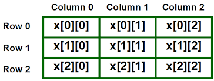

Lecture 1

# Dizilerin Genel Mantıkları
Java'da Diziler (Arrays) , her değer için ayrı değişkenler oluşturmak yerine, birden çok değeri tek bir değişkende depolamak için kullanılır. Değişkenler hafızada tek bir değer tutmamızı sağlar. Fakat bazı durumlarda, birden çok veriyi bir arada bulundurmak isteriz. Örneğin, bir sınıfta okuyan 20 öğrenci olsun. Bu 20 öğrenci için hafızada ayrı ayrı 20 tane değişken oluşturmak yerine, tek bir değişken kullanarak 20 öğrencinin koleksiyonunu tutmak isteyebiliriz.

Bu gibi durumlarda dizileri kullanırız. Dizi, aynı türden birden fazla değişkeni tutmamızı sağlayan hafıza birimidir. Kısaca, dizileri aynı türden elemanları gruplamak için kullanırız. Dizi oluşturduktan sonra dizinin içerisindeki elemanlara indeks numarasıyla ulaşır ve değiştiririz. Ayrıca, çok boyutlu diziler oluşturmak da mümkündür. Tek boyutlu dizi kullanabileceğimiz gibi 2 veya 3 boyutlu diziler de oluşturabiliriz. 2 boyutlu dizilere matris denir.

Dizi (Array) kavramı programlama dillerinde bir veri tipini ifade eder. Bu veri tipi liste halindeki ardışık verileri bir arada tutan yapıya denilir. Bu ardışık yapıya ait elemanlara indis yoluyla erişim sağlanabilir. Diziler sabit boyutludur ve tanımlanırken boyutları belirtilir.


Yukarıdaki örnek 10 eleman boyutunda "Integer" veri tipi tutan bir dizidir. Dizilerdeki herhangi bir elemana ulaşmak için indis numaraları kullanılır. Dizi indisleri her zaman 0'dan başlar o yüzden dizinin son elemanının değeri, dizi boyutuna eşit değildir ve bu dikkat edilmesi gereken bir konudur.

Dizinin hafızada bir başlangıç adresi olur ve ardışık olan diğer elemanlar sırayla hafızaya yerleştirilir. Diziler "new" anahtar sözcüğüyle oluşturulur. Böylece, Heap Hafıza bölgesinde yer kaplarlar.

```java
double[] myList;   // tercih edilen yol
```
VEYA 
```java
double myList[];   // başka türlü tanımlama biçimi
```
Diziler veri tipi ve [] parantezler ile belirtilir. Yukarıda iki farklı tanımı görülmektedir. Hafızadan yer alıp diziye alan ayırabilmek için "new" anahtar kelimesi kullanılır.

double[] myList = new double[10];
Yukarıda maksimum 10 eleman alabilen "double" veri tipinde olan bir dizi oluşturulmuştur.

Yukarıda "myList" isminde bir dizi tanımlamıştık. Tanımlanan dizi hafıza yukarıdaki şekildeki gibi tutulur. "myList" değişkeni dizinin başlangıç adresini tutar. Dizilerde ardışık bir sıra olduğu için ilk elemandan sonra gelen elemanların hafıza adresleri de birer birer artar. Dizi blok halinde yer kaplar. Diziye erişmek için indeks numarası kullanılır. Örneğin: "myList[0]" demek dizinin 1. Elemanını verecektir. Java'da dizilerin indeksleri sıfırdan başlar. Örneğin: "myList[5]", yani 5 nolu indeksteki dizi elemanını ver dediğimizde aslında dizinin 6. Elemanına erişmiş oluruz.

Örnekler:
```java
// Java'da diziye ilk değerler süslü parantezler arasında verilir.
double[] myList = { 1.9, 2.9, 3.4, 3.5 };

// tüm dizi elemanlarını arada boşuk bırakarak sırayla ekrana yazdırır.
for (int i = 0; i < myList.length; i++)
{
	System.out.println(myList[i] + " ");
}
```
Yukarıdaki örnekte myList isimli diziye ilk değerleri hemen verilmiştir. Süslü parantezler arasında kalan değerler dizi elemanlarıdır.

Ardından, bir "for" döngüsü ile dizi elemanları ekrana yazdırılır.

## Dizileri Fonksiyonlara Parametre Olarak Göndermek
Tanımladığınız dizileri fonksiyonlara parametre olarak gönderebilirsiniz.

Örneğin elimizde static bir fonksiyon olsun. Bu fonksiyona int tipinde verileri olan bir diziyi girdi (input) olarak vermek istersek aşağıdaki gibi olur.
```java
public static void printArray(int[] array)  {
   for (int i = 0; i < array.length; i++) 
   {
      System.out.print(array[i] + " ");
   }
}
```
printArray ( int[] array ) kırmızı olarak işaretlediğimiz yer diziyi yerel değişken olarak fonksiyona gönderdiğimiz noktadır. Java'da tüm değişkenler "Pass by Value" yöntemiyle geçilir. Bu şu demektir. Sizin tanımladığınız değişkenin, nesnenin veya dizinin birebir kopyası oluşturulur. Bu kopya değer fonksiyona yerel değişken olarak gider. Bu Java mülakatlarında size sorulabilecek bir detaydır.

## Dizileri Fonksiyonlardan Geri Döndürmek
Fonksiyonlar belli bir işi yapıp sonucunda değer dönebilen veya dönmeyen kod bloklarıdır. Fonksiyonlar için altın kural, her fonksiyonun tek bir işi olmalıdır. Örneğin: dizi ortalaması alma işi yapan bir fonksiyon dizileri ekrana yazdırma işini yapmamalıdır. Veya dizilerin ortalamasını alma işi ile dizileri toplama işlemi aynı fonksiyon içinde olmamalıdır. Her biri ayrı fonksiyonlar olmalıdır.

```java
public static int[] reverse(int[] list) 
{
   int[] result = new int[list.length];

   for (int i = 0, j = result.length - 1; i < list.length; i++, j--) 
   {
      result[j] = list[i];
   }
   
   return result;
}
```
Yukarıda dizinin tersine çevrilmiş halini döndüren bir fonksiyon vardır. public static int[] reverse(…) koyu renkle işaretlenen alan dizi döndüreceğimizi ve bu dizinin veri tipini söylüyoruz. Burada veri tipimiz "int".

---
Lecture 2

# Tek Boyutlu Diziler
Tek boyutlu diziler basitçe, aynı türden elemanların listesini tutan bir yapıdır. Dizi oluşturmak için, önce dizide yer alacak elemanların türü belirtilir, sonra diziye bir isim verilir ve isimden sonra köşeli parantezler ( [ ve ] ) konulur.
```java
int numbers[]; // Burada numbers isminde bir dizi oluşturuluyor
```
Köşeli parantezleri değişken isminden sonra koymak yerine, tür isminden sonra da yazabilirsiniz. Örneğin aşağıdaki kodun yukarıdakiyle bir farkı yoktur:
```java
int[] numbers; // Burada numbers isminde bir dizi oluşturuluyor
```
Diziler new deyimiyle oluşturulur. Dizi oluştururken kapasite değeri vermek zorunludur. Kapasite değeri, dizinin kaç eleman barındıracağını belirtir. Aşağıdaki örnekte, 5 adet int değişkeni tutabilecek bir dizi oluşturuluyor:
```java
int[] numbers = new int[5];
```
Bu ifade çalıştırıldığında, hafızada 5 adet int değişken için yetecek kadar alan ayrılır. Bu alanı düzenleyebilmek için indeks numaraları kullanırız. Dizi indeksleri 0’dan başlar ve kapasitenin 1 eksiğine kadar gider. Örneğin, yukarıdaki dizinin indeksleri 0’dan 4’e kadardır. Şimdi bu dizinin ilk elemanını verelim:
```java
numbers[0] = 10; // Dizinin ilk elemanı 10 olarak ayarlandı.
```
Dizinin diğer elemanlarını şu şekilde verelim:
```java
numbers[1] = 15;
numbers[2] = 20;
numbers[3] = 25;
numbers[4] = 30;
```
Bu kodlar çalıştırıldığında dizinin elemanları sırasıyla aşağıdaki gibi olur:
```java
{ 10, 15, 20, 25, 30 }
```
Aşağıdaki kodu çalıştırdığınızda konsola 25 yazar:
```java
System.out.println(numbers[3]);
```
Dizilerle uğraşırken indeks numaralarına çok dikkat etmelisiniz. Eğer dizinin aralığı dışında bir indekse erişmeye çalışırsanız, __IndexOutOfBoundsException__ hatası meydana gelir.
```java
System.out.println(numbers[5]); // Hata!
```
Yukarıdaki satır hataya neden olur; çünkü numbers dizisinin kapasitesi 5 olmasına rağmen dizinin 6. elemanına erişmeye çalışıyoruz.

Eğer dizinin içindeki elemanlar dizi oluşturulurken belliyse, diziyi oluştururken elemanları küme parantezi içinde ve virgülle birbirinden ayırarak verebiliriz:
```java
String[] weekDays = new String[] { "Pazartesi", "Salı", "Çarşamba", "Perşembe", "Cuma", "Cumartesi", "Pazar" };
```
Bu şekilde oluşturulan dizilere kapasite vermemize gerek yoktur; çünkü kapasite değeri zaten eleman sayısından bellidir. Yukarıdaki örnekte weekDays dizisinin kapasitesi otomatik olarak 7 olur.

Yukarıdaki gibi dizi oluştururken new deyimini kullanmaya gerek yoktur. Yani, yukarıdaki kodu aşağıdaki gibi yazabiliriz:
```java
String[] weekDays = { "Pazartesi", "Salı", "Çarşamba", "Perşembe", "Cuma", "Cumartesi", "Pazar" };
```
## Dizinin Kapasitesini Öğrenmek
Her dizinin length adında bir özelliği bulunur. Bu özelliği kullanarak dizinin kapasitesini öğrenebilirsiniz.

Örneğin, aşağıdaki kodu inceleyelim:
```java
int[] numbers = new int[100];
System.out.println(numbers.length); // Konsolda 100 yazar
```
## Dizinin Bir Elemanını Değiştirme
```java
String[] cars = {"Volvo", "BMW", "Ford", "Mazda"};
cars[0] = "Opel";
cars[2] = "Toyota";

System.out.println(cars[0]);
```

---
Lecture 3

# Çok Boyutlu Diziler
Java'da Çok Boyutlu Diziler varsayılan bir veri tipi olarak bulunmazlar ve matris olarak adlandırılırlar. Dizilerin 2 boyutlu halleri şeklinde tanımlanırlar. Matrisler satır ve sütun şeklinde tablo verisi formatındaki verileri tutmak için kullanılır. Diziler liste halinde veriler için uygunken, matrisler tablo şeklindeki veriler için uygundur. Oluşturulan tabloda bir değere ulaşmak istersek satır ve sütun sayısını girmemiz yeterli olacaktır.

İki boyutlu dizilerde tek boyutlu diziler gibi indis değeri 0'dan başlar. Dizide tutulacak veri tipleri aynı olmak zorundadır farklı veri tiplerini aynı matriste tutamayız.

3x3 boyutunda bir matris örneği :



Tablo oluşturup bu tablonun bilgilerini matris ile gösterelim. Örneğin, şehirler arasındaki mesafeyi gösteren bu tabloyu uzaklık değişkenimizde sakladık.

Mesafe Tablosu(KM)


```java
int[][] uzaklik ={
                {0, 453, 939, 243, 783, 891},
                {453, 0, 490, 384, 620, 439},
                {939, 490, 0, 839, 863, 423},
                {243, 384, 839, 0, 544, 823},
                {783, 620, 863, 544, 0, 1045},
                {891, 439, 423, 823, 1045, 0}
        };
```
## İki Boyutlu Dizi Tanımlama Yöntemleri
İki boyutlu dizileri oluşturmanın farklı yöntemleri var şimdi bunlara bakalım.

Bir değişkenin dizi olduğunu köşeli parantezler ile belirtmiştik. Bir tane köşeli parantez tek boyutlu dizi belirtir. Eğer çok boyutlu dizi oluşturmak istiyorsak, boyut sayısı kadar köşeli parantez belirtmeliyiz. Örneğin aşağıdaki satır 2 boyutlu bir dizi (yani matris) belirtir:
```java
degiskenTipi[][] arrayIsmi;
int matrix[][];
```
yada
```java
degiskenTipi arrayIsmi[][];  //bu yöntem tercih edilmez
```
İki boyutlu dizimizi tanımlarken değerlerini atamak istersek aşağıdaki yöntemi kullanabiliriz.
```java
int[][] array = {
{1, 2, 3}, 
{4, 5, 6}, 
{7, 8, 9}, 
{10, 11, 12} 
};
```
İlk köşeli parantez birinci boyutu (satırları), diğeri ise ikinci boyutu (sütunları) belirtir. Aşağıdaki kodu çalıştırırsak, 3 satırlı ve 4 sütunlu bir matris oluşturur:
```java
int matrix[][] = new int[3][4];
```
yada
```java
matrix = new int[3][4];
```
oluşturulan matrix değişkeninin default değeri (a) ile gösterilen tablodaki gibidir.
```java
[0][1][2][3]
[0] 0 0 0 
[1] 0 0 0 
[2] 0 0 0 
    (a)
```
Bu matrisin bütün elemanlarına ulaşmak için kullanmamız gereken indeks numaralarını aşağıdaki tabloda görebilirsiniz:


```java
matrix[1][2]; // Matrisin 2. satır ve 3. sütunundaki elemana erişiliyor
matrix[0][3]; // Matrisin 1. satır ve 4. sütunundaki elemana erişiliyor
matrix[2][0]; // Matrisin 3. satır ve 1. sütunundaki elemana erişiliyor
```
Matrisin 2. satırı ve 3. sütununda yer alan değerini 7 yapalım.
```java
matrix[2][1] = 7;
```
Atadığımız 7 değerine ulaşmak istersek matrix[2] [][][1] ifadesini kullanırız.

Fark ettiğiniz gibi matrislerin dizilerden tek farkı [] parantez yanına bir tane [] açıyoruz. Zaten her [] ifadesi yeni bir boyut anlamına geliyor. "double[][][] ucBoyutlu;" şeklinde bir ifadeyle 3 boyutlu veri saklayan bir veri yapısı oluşturmuş oluyoruz.

Şimdi güzel bir örnek yapalım. 3 satırdan ve 4 sütundan oluşan bir matris yaratalım ve bu matrisin elemanlarını sırayla 1’den başlayacak şekilde dolduralım. Aşağıdaki kodu inceleyelim:
```java
int[][] matrix = new int[3][4];
int number = 1;

for (int x = 0; x < matrix.length; x++)
{
	int[] row = matrix[x];

    for (int y = 0; y < row.length; y++)
	{	
		row[y] = number;
		number++;
	}
}
```
Şimdi yukarıdaki kodu inceleyelim. İki boyutlu diziyi oluşturduktan sonra önce for döngüsüyle dizinin satırlarını geziyoruz. Daha sonra içerideki for döngüsüyle dizinin sütunlarını dolaşıyoruz. Bu örneği vermemizdeki amaç, matrisin elemanlarına ulaşmak için iç içe 2 for döngüsü kullanmak gerektiğini göstermektir. Ayrıca dizinin length metodunun faydasını da burada görmüş oluyoruz.

Yukarıdaki kod çalıştığında matrisin elemanları şu şekilde olur:


## İç İçe Döngülerle Dizilere Erişim ve Dizi İşlemleri

Aşağıdaki kod bize bi matris değerini ekrana nasıl yazdıracağımızı gösterir. Döngüye girdikten sonra her sütun sayısı her satır için tek tek ekrana bastırılır. Her bir satırın tamamlanmasından sonra System.out.println() ile bir alt satıra geçilir.
```java
for (int row = 0; row < matrix.length; row++) {
   for (int column = 0; column < matrix[row].length; column++) {
       System.out.print(matrix[row][column] + " "); 
}
    System.out.println(); 
}
```
### İki Boyutlu Dizilerin Uzunlukları
İki boyutlu diziler aslında her satırının tek boyutlu olduğu dizilerdir. Çok boyutlu dizilerinde boyutuna ulaşarak işlem yapabiliriz.

Örneğin x = new int[3] [][][4] arrayinin x[0], x[1], x[2] değerleri tek boyutlu dizidir. Ve her biri aşağıdaki şekilde gösterildiği gibi 4 elemanı vardır. x.length değeri 3'tür, yani bize sahip olduğu 3 satırın değerini verir. Sütun sayısına ise her hangi bir satır değerinin uzunluğu kadardır. x[2].length değeri 4'tür.


Yukarıda öğrendiğimiz konuları pekiştirmek adına aşağıdaki kodu inceleyelim.
```java
public double[][] multiplyMatrices(double[][] firstMatrix, double[][] secondMatrix) {

	// firstMatrix.length ile ilk matrisin satır sayısını buluyoruz. örneğimizde 3 olarak gelecektir.
	// secondMatrix[0].length ile ikinci matrisin sütun sayısını buluyoruz. örneğimizde 4 olarak gelecektir.

	// C matrisi olacak olan matrisi tanımlıyoruz.
    double[][] result = new double[firstMatrix.length][secondMatrix[0].length];
 
 	// matrislerde çarpma, toplama gibi işlemleri yapabilmek için iç içe 3 tane döngüye ihtiyaç duyarız.
    for (int row = 0; row < result.length; row++) {
        for (int col = 0; col < result[row].length; col++) {
            result[row][col] = multiplyMatricesCell(firstMatrix, secondMatrix, row, col);
        }
    }
 
    return result;
}


double multiplyMatricesCell(double[][] firstMatrix, double[][] secondMatrix, int row, int col) {
	// A matrisinin satırı ile B matrisinin sütunu çarpma işlemi.
	/*
	*   row = 3, col = 4  olarak gelecektir.
	*   i = 0 ise
	*   firstMatrix[3][0] * secondMatrix[0][4] 
	*   i = 1 ise
	*   firstMatrix[3][1] * secondMatrix[1][4] 
	*   i = 2 ise
	*   firstMatrix[3][2] * secondMatrix[2][4] 
	* şeklinde i değişerek satır ve sütun çarpılır.
	*/
    double cell = 0;
    for (int i = 0; i < secondMatrix.length; i++) {
        cell += firstMatrix[row][i] * secondMatrix[i][col];
    }
    return cell;
}
```
Yukarıdaki “multiplyMatrices” fonksiyonu iki tane matrisi girdi olarak alır. Fonksiyon matrislerin çarpım sonucunu matris olarak döndürür.

“multiplyMatrices” fonksiyonu içinde bir başka fonksiyon daha çağrılmıştır. “multiplyMatricesCell” bu fonksiyon ise iki matrisin satır ve sütununu çarpıp sonucu double tipte bir değer döndürür.

### Sütun Kapasiteleri Farklı Matris Oluşturmak - Düzensiz Diziler
Farklı sütun değerine sahip dizilere "Ragged Arrays" yani düzensiz diziler denir. Başka bir açıdan bakıldığında ise, 2 boyutlu dizileri, dizilerin dizisi (array of arrays) olarak düşünmek doğru olur. Yani iki boyutlu dizileri tek boyutlu diziler oluşturur.

Diziler aynı türden elemanlardan oluşmak zorundadır. int türünde bir dizi olabileceği gibi, dizinin dizisi de olabilir.

Yukarıdaki örneklerde matrisin sütun sayısını 4 olarak belirledik. Bu şekilde oluşturulursa matrisin bütün satırları 4 elemanlı olur. Fakat bu zorunlu değildir. Matris oluştururken sütun sayısı belirlemezsek, her bir satırdaki dizilerin kapasitesi farklı olabilir. Örneğin aşağıdaki kodu inceleyelim:
```java
int[][] matrix = new int[3][];
matrix[0] = new int[1];
matrix[1] = new int[2];
matrix[2] = new int[3];
```
Burada önce 3 satırdan oluşan bir matris belirttik, fakat sabit bir sütun sayısı vermedik. Sonra her bir satır için ayrı ayrı sütun sayısı belirledik.

Çok boyutlu dizi oluştururken, yalnızca ilk boyutun (en soldaki) kapasitesini belirlemeniz yeterlidir. Diğer boyutların kapasitesini dinamik olarak belirleyebilirsiniz.

#### Sıra Sizde!
Aşağıda verilen örneklerin cevaplarına bakmadan önce kendiniz kodlamaya çalışmanızı öneririz. Daha sonra zorlandığınız noktalarda ufak yardımlar almak için bakabilirsiniz. Bu sizin öğrenmenize daha yardımcı olacaktır.

Matris boyutunu sizin belirlediğiniz matris değerlerini ise kullanıcının girdiği bir algoritma yazınız.

Cevap:
```java
int matrix[][] = new int[3][4];
        Scanner input = new Scanner(System.in);
        System.out.println("Enter " + matrix.length + " rows and "
                + matrix[0].length + " columns: ");
        for (int row = 0; row < matrix.length; row++) {
            for (int column = 0; column < matrix[row].length; column++) {
                matrix[row][column] = input.nextInt();
            }
        }
```
İstediğiniz boyutta matris oluşturarak matris değerlerine 0-99 arası random sayılar üreterek matrise atama yapınız.

Cevap:
```java
int[][] matrix = new int[3][4];
        for (int row = 0; row < matrix.length; row++) {
            for (int column = 0; column < matrix[row].length; column++) {
                matrix[row][column] = (int) (Math.random() * 100);
            }
        }
```
Aşağıdaki kod bloğunun çıktısı nedir?
```java
  int[][] array = {{1, 2}, {3, 4}, {5, 6}};
        for (int i = array.length - 1; i >= 0; i--) {
            for (int j = array[i].length - 1; j >= 0; j--) {
                System.out.print(array[i][j] + " ");
            }
            System.out.println();
        }
```
Cevap:
```java
6 5 
4 3 
2 1 
```

---
Lecture 4

# ForEach Kullanımı
Java'da ForEach deyimi adında da anlaşılacağı gibi bir döngüyü ifade eder. Genelde dizilerdeki ve listelerdeki elemanları daha hızlı şekilde ulaşmak için kullanılan kısa bir yöntemdir. Kısacası for döngüsünün modifiye edilmiş halidir.
```java
for (veritipi degisken: diziAdi) {
  // kod bloğu
}
```
Örnekte Java'da ForEach kullanımını görmektesiniz, yine bir for döngüsü oluşturuyoruz ama iki parametreyi iki nokta ile ayırıyoruz. İlk kısmında dizinin döndüreceği veri tipini ve for içinde dizinin elemanı olarak kullanacağınız değişkeni tanımlıyorsunuz, diğer kısımda ise dizimizin ismini yazıyoruz.

Bu örneğimizde arabalar dizisinin forEach ile nasıl kullanıldığını görmektesiniz.
```java
String[] arabalar = {"BMW", "Mercedes", "Ford", "Ferrari"};
for (String i : arabalar) {
  System.out.println(i);
}

// Çıktısı
// BMW
// Mercedes
// Ford
// Ferrari
``` 
Çok boyutlu dizilerde forEach kullanımı
```java
public class Main {public static void main(String[] args) {
        int[][] matris = {
                {1, 2, 3},
                {4, 5, 6},
                {7, 8, 9},
                {10, 11, 12}
        };

        for (int[] u : matris) {
            for (int elem : u) {
                System.out.println(elem);
            }
        }
    }
}
```
---
Lecture 5

# Arrays Sınıfı ve Metotları
Java.util paketindeki Arrays sınıfı, Java Collection Framework'ün bir parçasıdır. Bu sınıf, Java dizilerini dinamik olarak oluşturmak ve bunlara erişmek için statik metotlar sağlar. Yalnızca statik metotlar ve Object sınıfının metotlarından oluşur. Bu sınıfın metotları, sınıf adının kendisi tarafından kullanılabilir.

import java.util.Arrays;
Import deyimi ile java.util.Arrays sınıfını projeye dahil etmemiz gerekmektedir.

## Arrays.toString()
Diziye ait elemanları direk ekrana basmak için kullanılan bir metottur.

```java
import java.util.Arrays;

public class Main {
    public static void main(String[] args) {
        int[] dizi = {3, 5, 79, 12, 25, -3, 66, 82, -49, 152};
        System.out.println(Arrays.toString(dizi));
    }
}

// Çıktısı
// [3, 5, 79, 12, 25, -3, 66, 82,-49,152]
```
## Arrays.fill()
Arrays.fill metodu ile dizilerimizin belirli bir bölümlerine değerler atayabiliriz.
```java
import java.util.Arrays;

public class Main {
    public static void main(String[] args) {
        int[] liste = {15, 1, 99, 7, 7, -22, 11, 2, -49, 52};

        Arrays.fill(liste, 2);
        System.out.println(Arrays.toString(liste));

        int[] liste2 = {15, 1, 99, 7, 7, -22, 11, 2, -49, 52};

        Arrays.fill(liste2, 3, 5, 7);
        System.out.println(Arrays.toString(liste2));
    }
}

// Çıktısı
// [2, 2, 2, 2, 2, 2, 2, 2, 2, 2]
// [15, 1, 99, 7, 7, -22, 11, 2, -49, 52]
```
## Arrays.sort()
Arrays.sort() metodu ile dizilerdeki elemanları sıralayabiliriz.
```java
import java.util.Arrays;

public class Main {
    public static void main(String[] args) {
        int[] liste = {6, 1, 55, 21, 33, -321, -21, 2, -11, 27};
        Arrays.sort(liste);
        System.out.println(Arrays.toString(liste));
    }
}
// Çıktısı
// [-321, -21, -11, 1, 2, 6, 21, 27, 33, 55]
```
## Arrays.binarySearch()
Java'da dizideki bir elemanın indis değerini bulmak için binarySearch kullanılabilir. Ama bu metodu kullanabilmek için, dizinin sıralı olması gerekmektedir.
```java
import java.util.Arrays;

public class Main {
    public static void main(String[] args) {
        int[] liste = {6, 1, 55, 21, 33, -321, -21, 2, -11, 27};

        Arrays.sort(liste);
        System.out.println(Arrays.toString(liste));

        int index = Arrays.binarySearch(liste, 33);
        System.out.println("33'ün indeksi :" + index);
    }
}
// [-321, -21, -11, 1, 2, 6, 21, 27, 33, 55]
// 33'ün indeksi :8
```
## Arrays.copyOf() ve Arrays.copyOfRange() metotu
Mevcut diziden belli bir uzunlukta yeni bir dizi oluşturmak için Arrays.copyOf() metotu kullanılır

Mevcut diziden belli bir aralıkta yeni bir dizi oluşturmak için ise Array.copyOfRange() metodu kullanılır.
```java
import java.util.Arrays;

public class Main {
    public static void main(String[] args) {
        int[] liste = {6, 1, 55, 21, 33, -321, -21, 2, -11, 27};

        int[] copyArray = Arrays.copyOf(liste, 3);
        System.out.println(Arrays.toString(copyArray));

        int[] copyOfRangeArray = Arrays.copyOfRange(liste, 0,5);
        System.out.println(Arrays.toString(copyOfRangeArray));
    }
}
// [6, 1, 55]
// [6, 1, 55, 21, 33]
```
## Arrays.equals() metotu
Java'da iki dizinin eşitliğini kontrol etmek için Arrays.equals() metotu kullanılır.
```java
import java.util.Arrays;

public class Main {
    public static void main(String[] args) {
        int[] list1 = {1, 2, 3};
        int[] list2 = {1, 2, 3};
        int[] list3 = {1, 2, 10};

        System.out.println(Arrays.equals(list1, list2)); // true
        System.out.println(Arrays.equals(list2, list3)); // false
    }
}
```