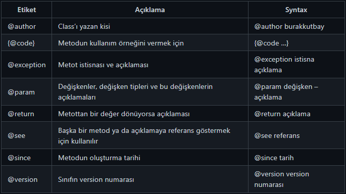

Lecture 1

# Java’da Yazım ve İsimlendirme Kuralları

## Yazım Kuralları

- __Türkçe Karakter__ Kullanımı : Java ve bir çok programlama dili Türkçe karakter desteklememektedir. Programda ki metin ifadeleri dışında Türkçe karakter kullanılmamalıdır. Türkçe Karakterler : ç, ı, ü, ğ, ö, ş, İ, Ğ, Ü, Ö, Ş, Ç

- __Harf Duyarlılığı__ : Java harfe duyarlı bir dildir. Kelimelerdeki küçük ve büyük harfler farklı olarak algılanır. Java’da Kodluyoruz ile kodluyoruz farklı anlama gelmektedir.

- __Sınıf Adları__ : Java’da sınıf adlarının ilk harfi büyük olmalıdır. Eğer 2 kelimeyi birleştirerek bir sınıf adı oluşturursak bu isimlerin baş harfleri büyük olmalıdır. Örnek: CamelCase

- __Metot Adları__ : Metot adları küçük harfle başlar. Metot adı verilirken iki kelime birleştirilecekse ismin başlangıç harfi küçük diğer birleştirilen kelimelerin başlangıç harfleri büyük yazılır. Örnek: camelCaseOrnek

## İsimlendirme Kuralları

### Camel Case Nedir ?

Camel Case, bir bileşik sözcük içindeki her kelimenin ilk sözcük dışında ki sözcüklerin ilk harfleri büyük harflerle yazıldığı bir adlandırma kuralıdır. Yazılım geliştiricileri genellikle kaynak kodu yazarken "Camel Case" kullanır. Camel Case kullanımı zorunlu bir kullanım olmasa da yazılım dilinin jargonudur ve genelde tüm yazılımcılar bu kurala uyar. Bu kural sayesinde değişken isimleri daha okunur olur.

__Örnek__ : patikaDev, camelCaseKurali, javaPatikasiBasliyor

#### Upper Camel Case Nedir ?
Upper Camel Case isimlendirme kuralı ise, bileşik bir sözcükteki tüm sözcüklerin ilk harflerinin büyük olmasıdır.

Örnek : PatikaDev, UpperCamelCaseKurali, JavaPatikasiBasliyor

#### Snake Case
Kelimeler alt tire (_) ile birbirine bağlanır.

Upper snake case örnek: Hello_World

Lower snake case örnek: hello_world

#### Screaming Snake Case
Bütün harfleri büyük yazılır. Genellikle sabit isimlendirmede kullanılır.

#### Java'da İsimlendirme Kuralları

- Java'da isimlendirilen tüm ögeler sadece A-Z veya a-z gibi harfler, $ karakteri veya _ karakteri ile başlayabilirler.
- Keyword’ler (Yasaklı Kelimeler) isimlendirmede kullanılamaz


- Sınıflar için upper camel case kullanılır. HelloWorld
- Metotlar için lower camel case kullanılır. helloWorld
- Değişkenler için lower camel case kullanılır. helloWorld
- Sabitler için screaming snake case kullanılır. HELLO_WORLD


---
Lecture 2

# Main Metodu ve Kullanımı
Java'da bir program çalışacağı zaman, kodlar ilk olarak main metodu içerisinden başlar. Main metodu sayesinde derleyiciye, programı buradan başlatılması konusunda referans oluşturulur.

```java
public class JavaPatika {
    public static void main(String[] args) {
        System.out.println("Hello World!");
    }
}
```
Artık programı çalıştırdığımızda, derleyici ilk olarak main metodu okuyup sonrasında gerekli işlemleri yapacaktır.

Main metodu yazılırken, args yerine başka bir isimlendirme yapılabilir. Ancak genellikle args sözcüğü kullanılır ve bu sözcük arguments sözcüğünün kısaltmasıdır. Arguments ile ifade edilen kısım, sınıf çalıştırılırken JVM tarafından bu sınıfa verilen parametrelerdir.


---
Lecture 3

# Programlamaya Başlangıç
İlk öğreneceğimiz kod parçacığı, Java'da ekrana veri bastırma kodu olan __System.out.println("Java101");__ komutunu öğreneceğiz. Ama ilk önce bilmemiz geren bir konu Java'da kodların nereye yazıldığı ve yazım kuralları ya da diğer adıyla söz dizimi (Syntax). Genellikle Syntax olarak İngilizce adıyla duyduğumuz bu terim herhangi bir programlama dilinin yazım kuralını belirler.

## Genel Sözdizimi (Syntax)


Yukarıda ki örnekte göreceğiniz gibi, en üst kısımda "public class Sinif" komutu ile bir sınıf (class) oluşturuyoruz. Java'da sınıflar içerisine kodlarımızı yazarız ve ilerleyen derslerde sınıflar konusuna derin bir giriş yapacağız. Daha sonra program çalıştığında çalışan bir metot olan "Main Metodu" sınıfımızın içerisine yazarız çünkü programı çalıştırmak için derleyici ilk olarak main metot içerisindeki komutları okuyacaktır.

Main metot içerisine "Gövde (body)" adını veririz ve komutlarımızı ya da diğer adıyla ifadelerimizi gövde içerisine yazarız. Buraya yazdığımız kodlar derleyici tarafından yorumlanır ve çıktı olarak kullanıcıya verir. Genel olarak Java'nın Genel Sözdizim kuralları bu şekildedir.

### Ekrana Veri Yazdırma
Java'da ekrana veri yazdırmak için ```System.out.print("Hello World!")``` kod parçacığı kullanılır. Bu komuta baktığımızda, iki parantez arasında, çift tırnaklar arasına ekrana yazdırmak istediğimiz sözcüğü yazmalıyız. Bu komutun iki farklı kullanım şekli mevcuttur, yazılan komuttan sonra yeni satıra inilmesi isteniyorsa ```System.out.println();``` kullanılırken aynı satırda kalınması isteniyorsa ```System.out.print();``` şeklinde kullanılır.

### Escape Karakterler
Java'da Escape (Kaçış) karakterleri ile bazı özel durumlar durumlar gerçekleştirilir. Kaçış karakterleri ( / ) ters eğik çizgi ile ifade edilip sonrasında yazılan karakter ile özel işleve sahip olurlar.


---
Lecture 4

# Yorum Satırları
Yorum satırları, kod içi belgeleme amacıyla kullanılan ve derleyiciler tarafından dikkate alınmayan kod parçalarıdır. Yorum satırları oluşturmamızın sebebi, Yazdığı kodun kritik kesimlerini açıklayarak, o koda daha sonra bakan kimselerin (büyük olasılıkla kendisinin) işini kolaylaştırmak amaçlanmaktadır. Java’da yorum satırları 3 farklı şekilde yazılır:

## // ile yapılan yorumlar
Tek satırlık bir açıklama yapılacaksa o satırın başına // işareti yazılır. ; // işaretinden sonra satır sonuna kadar her şey yorum olarak kabul edilir. Anlaşılacağı üzere bu işaretin satırın en başında olması zorunlu değildir. Ancak kodlama alışkanlığı bakımından satır başında kullanılması daha uygundur.

```java
// bu bir yorum satırıdır
int number = 10; // number değişkenine 10 değeri atandı.
```

## /* ... */ ile yapılan yorumlar
Eğer birden fazla satırda yazılan bir açıklama varsa, her satırın başına // işareti koymak programcıya zor gelebilir. Bunun yerine, açıklama olarak değerlendirilmesi istenen satırlar /* ve */ işaretleri arasına alınır. Bu iki işaret arasında kalan kesimler derleyici tarafından yorum satırı olarak kabul edilir.
```java
/* Birden fazla satırdan oluşan bir yorum satırlarıdır. Ancak yorumların bu yolla ifade edilmesi için birden fazla satırdan oluşması zorunluluğu yoktur. */
int number = 10; // number değişkenine 10 değeri atandı.
```
/** ... */ ile yapılan açıklamalar
Bir uygulama geliştirilirken kod içi belgeleme yapmak güzel bir programlama alışkanlığıdır. Çünkü hem yapmakta olduğunuz işi en güzel o işi yaparken açıklayabilirsiniz, hem de açıklayabildiğiniz kodu anlamışsınız demektir ve o kodu açıklayarak yazdığınız için hata yapma olasılığınız düşer.

Öte yandan, çoğu zaman uygulamaların raporlarının oluşturulması gerekir. Kod yazıldıktan sonra kodun içine yazılan açıklamalardan bir belge oluşturarak bu belgeyi raporun sonuna eklemek programcının yükünü hafifletecektir. İşte şimdi bahsedeceğimiz üçüncü yöntem bu amaçla kullanılır. /** ve */ işaretleri arasına yazılan açıklamalar bir takım özel etiketler içerebilir. Kod içi belgeleme, bu etiketleri tanıyan ve etiketlerden faydalanarak belge üreten bir aracın yardımı ile belgeye dönüştürülebilmektedir.

Bu tarzda yazılan açıklama satırlarına Javadoc adı verilmektedir. Javadoc için kullanılabilecek bazı örnekler ve ne için kullanılabilecekleri aşağıda listelenmiştir:




```java
/**
* @author M.Mustafa Çetindağ - 11.Nis.2021
  */
  public class AciklamaSatiriOrnegi {
  /**
    * Verilen sayının karekökünü bularak döndürür.
    * Sayının sıfırdan küçük olmadığını varsayar.
    *
    * @param sayi Karekökü alınacak sayı
    * @return Sayının karekökü
      */public double karekok(double sayi) {
      double kkok = 0;
      // burada karekök bulma algoritmasının çalıştığını kabul edelimreturn kkok;
      }
```