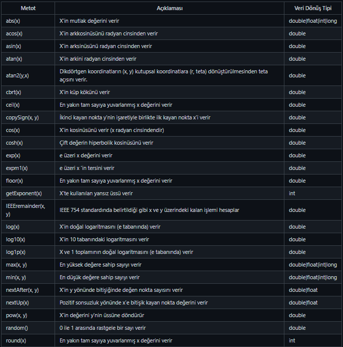
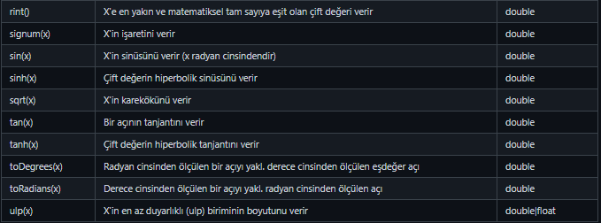
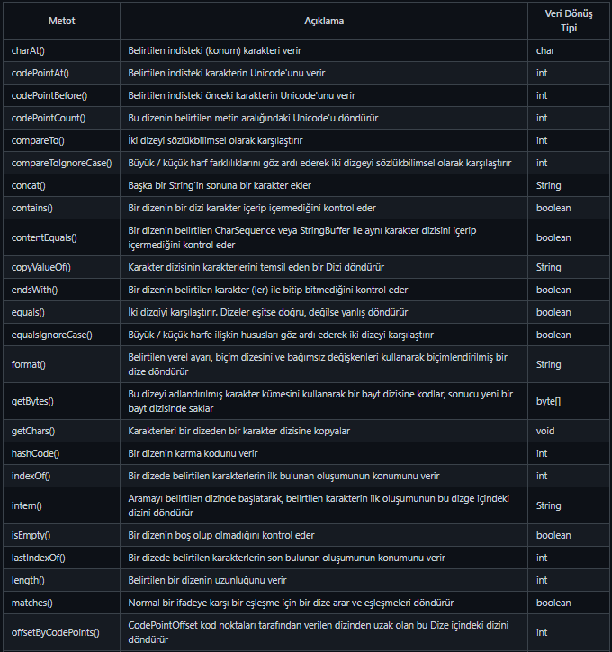
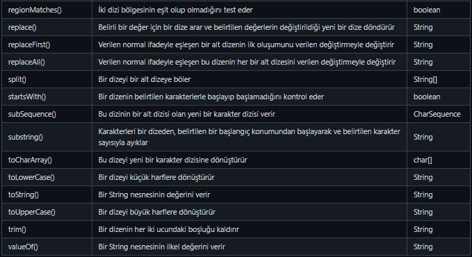

Lecture 1

# Math Sınıfı ve Metotları
Java bazı durumları bizim için önceden yazdığı sınıflar ile bizlerin işini kolaylaştırmıştır. Bunlardan bir tanesi de Math sınıfıdır. Adında da anlaşılacağı gibi Java'da Math sınıfı matematiksel fonksiyonlar sunmaktadır. Java Math sınıfı, sayılar üzerinde matematiksel işlemler gerçekleştirmenize izin veren birçok metoda sahiptir.

Math sınıfının kullanımı şu şekildedir;
```java
Math.MethodAdi(Parametreler)
```
## Math Sınıfı Metotları





---
Lecture 2

# String Sınıfı ve Metotları
Java'da String sınıfları char türünden verilerden oluşmuş bir kümedir yani karakterlerden oluşur. Java işlerimizi kolaylaştırmak ve String ifadelerle işlem yapmak için String sınıfını sunar.

## Java String Sınıfı Metotları





---