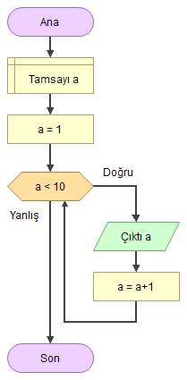

Lecture 1

# Döngü Yapıları
Döngüler, belirli bir koşul sağlandığı sürece tekrarlanması gereken işler için kullanılan programlama kodlarıdır. Döngü deyimleri, bahsedilen komut parçalarının belirtilen şartlar gerçekleştikçe tekrar tekrar işlenmesini sağlar. Java’da for, while ve do-while olmak üzere 3 adet döngü deyimi bulunmaktadır.

Kısacası : Döngü yapıları kodumuzun belirli kısımlarının döngüye girmesini ve birden fazla kez çalışmasını sağlar. Döngüler bir koşula bağlanır ve bu koşul var olduğu sürece aynı kod bloğu çalışmaya devam eder. Koşul artık sağlanmıyorsa döngü sona erer.



---
Lecture 2

# While Döngüsü
While döngüsü Java'nın temel yapı taşlarından bir tanesidir. While terimini yazdıktan sonra yanına bir parantez açılıp kapatılır ve bu parantezler arasına boolean bir değer girilir. Sonrasında bir süslü parantez açılıp kapatılır ve bunun içine kod bloğu yazılır. Bu parantezler içindeki değer doğru(true) olduğu sürece döngü dönmeye devam eder ve kod bloğu çalışır.

## While döngüsü söz dizimi şu şekildedir ;
```java
while(kosul){
   //kod bloğu
}
```
Burada belirtilen koşul, boolean bir ifadedir. Bu koşul true olduğu sürece döngü devam eder. Koşul false olursa döngü sonlanır. Koşul ifadesi parantez içine yazılır. Eğer döngüye girecek kod tek satırdan oluşuyorsa blok açmaya gerek yoktur; fakat birden fazla satırdan oluşuyorsa mutlaka blok açılmalıdır.
```java
int i = 1;
while (i <= 5) {
   System.out.print(i + ',');
   i++;
}
```
Bu Java'da While kullanımı örneğinde, i değeri 5'e eşit ve küçük olduğu sürece döngü çalışmaya devam edecektir ve çıktısı şu şekilde olacaktır ; 1,2,3,4,5,

Döngülerin içeriği olmak zorunda değildir. Bazı durumlarda döngüye girecek kod olmasa bile döngüye girebiliriz. Aşağıdaki örneği inceleyelim:
```java
int left = 100, right = 200;
while (++left < --right);
System.out.println("100 ile 200'ün ortası: " + left);
```
Bu algoritma, 100 ile 200’ün arasında tam ortada bulunan sayıyı bulmamızı sağlar. Kodu çalıştırdığımızda çıktısı şu şekilde olur:
```java
100 ile 200'ün ortası: 150
```
Gördüğünüz üzere, içeriği olmasa bile bazı durumlarda döngüler fayda sağlayabilir.

Yani while döngüsü genellikle işlemin kaç kez tekrar edeceği bilinmediği durumda kullanılır. Örneğin: müşterinin hesabına giriş şifresini kaç kez yanlış gireceğini bilemeyiz. Bu nedenle bu tarz durumlarda "while" döngüsü tercih edilir hemen aşağıdaki örnekte olduğu gibi.
```java
Scanner scanner = new Scanner(System.in);
String customerPassword = "12345";
boolean passwordSuccessfull = false;

while(!passwordSuccessfull) {
	
	System.out.println("Hesap şifrenizi giriniz:");
	String typedPassword = scanner.next();
	
    if(customerPassword.contentEquals(typedPassword)) {
		passwordSuccessfull = true;
		System.out.println("Sisteme başarılı giriş yaptınız!");
	}
}
```
Java programla dilinde while döngüleri yapacağımız işin ne zaman biteceğiniz bilmediğimiz durumlarda kullanışlı olabilmektedir.

---
Lecture 3

# Do-While Döngüsü
Do-while döngüsünün çalışma mantığı while döngüsü ile aynıdır , fakat while döngüsünde parantez içerisindeki koşul sağlandığı sürece kod bloğu çalışacaktır. Ama Do-while döngüsünde durum false olsa bile döngü en az bir kere çalışacaktır. Bu tür durumlar için Do-while kullanılır.

Java Do-While döngüsü söz dizimi şu şekildedir ;
```java
do {
kodlar//
} while (kosul);
```
Gördüğünüz gibi, koşul döngünün sonunda test edilir. Bu durumda, koşul false olsa bile döngü en az bir kere çalıştırılmış olur. Bu şekilde döngü yazmak istediğiniz durumlarla karşılaşacaksınız. Aşağıdaki örneği inceleyelim:
```java
int year = 2020;
do
{
	System.out.println(“Döngü işletiliyor..”);
	year++;
} while (year < 2020);
```
Bu kod çalıştırıldığında çıktısı aşağıdaki gibi olur:
```java
Döngü işletiliyor..
```
Gördüğünüz gibi year değişkeni 2020’den küçük olmamasına rağmen döngü en az bir kere çalıştırılmıştır.

## Java While ve Do-While Arasındaki Farklar ?
Java'da Do-While ve While döngüleri arasındaki tek fark , Do-while döngüsünde, döngü bloğu içindeki kod kesimi en az bir kez mutlaka işletilecektir. Çünkü önce döngü bloğu işletilip sonra koşul denetlenmektedir. While döngüsünde ise önce koşula bakılıp sonra döngü bloğu işletildiği için, döngüye hiç girilmemesi olasıdır.

---
Lecture 4

# For Döngüsü
Java'da döngüler konusunda öğrendiğimiz gibi For döngüsü ile bir koşul belirterek döngülerimizi oluşturabiliriz.
```java
for (durum 1; durum 2; durum 3) {
  // çalışacak kod bloğu
}
```
For döngüsü şu şekilde işler: İlk olarak döngüde sayaç işlevi görecek bir değişken oluşturulur. Bu değişkenin ilk değeri [durum 1] ile belirtilen kısımda verilir. Bu değişken [durum 3] kısmında isteğe göre artırılır veya azaltılır. Döngünün hangi koşulda çalışacağı ise [durum 2] kısmında boolean bir ifadeyle belirtilir.
```java
for (int i = 0; i < 10; i++) {
  System.out.println(i);
}
```
Bu For Döngüsü örneğinde 1'den 10'a kadar olan sayıları ekrana yazdırdık.

__İlk durumda__, i adında türü int olan ve varsayılan değeri 0 olan bir değişken tanımladık. Bu değişken bizim kodumuzda sayaç görevi görecektir.

__İkinci durumda__, döngünün çalışması için gerekli koşulu tanımlar (i, 10'ten küçük olmalıdır). Koşul doğruysa döngü yeniden başlayacak, yanlışsa döngü sona erecektir.

__Üçüncü durumda__, döngüdeki kod bloğu her çalıştığında değeri 1 arttıran kodumuzu yazdık.

---
Lecture 5

# For ve While Döngüsü Arasındaki Farklar
Java’da for, while ve do-while olmak üzere 3 adet döngü deyimi bulunmaktadır. Birbirinden farklı bu döngülerden hangisini kullanacağız ?

Hiç bir algoritmada hangi döngünün kullanılması gerektiği ile ilgili kesin bir yargı ve kural söz konusu değildir. Bu döngüler uygun şekilde tasarlandıkları sürece aynı işi yapabilirler. Ama genellikle, kaç kere döneceği belli olmayan, koşulun bir girdiye göre denetlendiği durumlarda While ya da do-while döngüsü kullanılırken, diziler gibi, tekrar sayısı belirli olan durumlarda ise for döngüsü kullanılması tercih edilir. Ama yine bu yazılımcının kendisine bağlıdır.

---
Lecture 6

# Continue ve Break Komutları
## Continue Deyimi
Java'da "continue" deyimi , döngü içinde bir koşul oluştuğunda o döngüyü tamamlamadan bir sonraki kademeye geçmeye yarar.
```java
int i = 0;
while (i < 10) {
  i++;
  if (i == 5) {
    continue;
  }
  System.out.println(i);
}
```
Örnekte görüldüğü gibi eğer i değişkeni 5 sayısına eşit olduysa, o kod bloğundan sonraki kodlar çalışmayıp döngü bir sonraki adıma geçiş yapacaktır.

## Break Deyimi
Buraya kadar gördüğümüz bütün döngüler belirlediğimiz bir koşula göre kontrol ediliyor ve bu koşul sağlandığı sürece çalışıyordu. Bazı durumlarda, döngü koşulu sağlansa bile başka bir nedenden ötürü döngüyü sonlandırmak isteyebiliriz. Bu tarz durumlarda break deyimini kullanırız. Bu deyim, içinde kullanıldığı döngüyü anında sonlandırır.
```java
for (int i = 0; i < 10; i++) {
  if (i == 5) {
    break;
  }
  System.out.println(i);
}
```s
Örnekte görüldüğü üzere döngü içinde ki koşul tamamlanmadan i değişkeni 5 değerine ulaştığında "break" komutu ile döngümüzü bitirebiliriz.

---