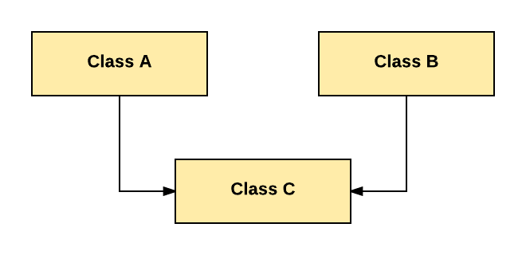

Lecture 1

# Encapsulation (Kapsülleme)
Sarmalama ilkesi, bir sınıfa ait değişkenlerin veya niteliklerin ancak o sınıfa ait metotlar tarafından değiştirilebilmesi ve okunabilmesi ilkesidir. Bu ilke sayesinde nesnelerde oluşacak anlamsızlıkların önüne geçilebilir.

Ayrıca değişkenlere sınıfların dışından erişim olmaması ve bir sınıf içindeki değişkenlerin nasıl ve ne kadar olacağının da başka kodlardan saklanmış olması anlamına gelir. Böylelikle biz değişkenlerimizi sarmalayarak istenmeyen durumlardan korunacak bir filtre haline dönüştürebiliriz. Bunu bir örnek ile anlamaya çalışalım.

## Encapsuliaton Örneği
Kitap adında bir sınıfımız olsun ve bu sınıfımıza ait 3 adet değişkenimiz olsun bunlar ; kitapAdi, sayfaSayisi ve yazar. Bu değişkenlerin erişim belirleyicileri public olsun ve her sınıftan erişilsin. Kitap sınıfından oluşturacağımız bir nesne bu niteliklerin hepsini taşısın. Bu yüzden oluşturacağımız Constructor (kurucu) metodunu bu şekilde oluşturalım.
```java
public class Kitap { public int sayfaSayisi; public String kitapAdi, yazar; Kitap(String kitapAdi, int sayfaSayisi, String yazar) { this.kitapAdi = kitapAdi; this.sayfaSayisi = sayfaSayisi; this.yazar = yazar;     }
}
```
Görüldüğü üzere normal bir sınıfımız ve kurucu metodumuz var. Kitap sınıfından bir nesne oluşturalım.
```java
Kitap book = new Kitap("Harry Potter", 500, "JK Rowling");
```
Kitap sınıfından book adlı bir nesne oluşturduk ve bu nesnemizin niteliklerini belirttik. Peki biz bu kurucu metotta sayfa sayısını negatif bir değer girseydik ne olurdu ? Hiç bir kitabın sayfa sayısı negatif bir değer olamayacağı için, nesnemizde bir anlamsızlık olacaktı. Biz bu sorunu constructor (kurucu) metotumuza yazacağımız bir if kontrolü ile çözebiliriz.
```java
public class Kitap { public int sayfaSayisi; public String kitapAdi, yazar; Kitap(String kitapAdi, int sayfaSayisi, String yazar) { this.kitapAdi = kitapAdi; this.yazar = yazar; if (sayfaSayisi < 1) { this.sayfaSayisi = 10; } else { this.sayfaSayisi = sayfaSayisi;         }
    }
}
```
Constructor metodu görüldüğü gibi modifiye ettik ve nesne oluşturulurken anlamız verilerin olmasını engelledik. Ama sorunlarımız hala bitmedi , biz nesneye ait niteliklere hala dışarıdan erişebiliyoruz ve book.sayfaSayisi = -10 dersek , nesneye ait sayfa sayısını yine anlamsızlaştırmış oluruz. Bu sorunu çözmek için sınıfa ait değişkenlere dışarıdan erişimi kapatmamız gerekir ve oluşturduğumuz değişkenlerin erişim belirleyicilerini (Access Modifiers) değiştirmemiz gerekli. Tüm public'leri private olarak değiştiriyoruz.

Sınıfımızın son hali
```java
public class Kitap { private int sayfaSayisi; private String kitapAdi, yazar; Kitap(String kitapAdi, int sayfaSayisi, String yazar) { this.kitapAdi = kitapAdi; this.yazar = yazar; if (sayfaSayisi < 1) { this.sayfaSayisi = 10; } else { this.sayfaSayisi = sayfaSayisi;         }
    }
}
```
Sınıfa ait değişkenlerimin izinlerini private yaparak bu sorunu çözdük ama, biz book nesnesine ait değişkenlere erişimi tamamen kısıtladık. Yani biz oluşturduğumuz nesneye ait sayfa sayısını ekrana bastıramayız çünkü değişken private olarak tanımlandı. Ya da sayfa sayısı yanlış girilmiş bir nesneyi daha sonrasında düzenleyemeyiz. Bu sorunu çözmek için sınıfa ait değişkenlerimizi sarmalayarak, sınıf içerisinde ki metotlar yardımı ile değişkenlerimizi koruma altına alıyoruz ve kullanıma sunuyoruz. Bu metotlara sonrasında ismini çok duyacağımız Getter ve Setter metotları diyoruz.

# Getter ve Setter Metotları
## Getter
Sınıfımıza ait private değişkenler mevcut. Bu değişkenlere dışarıdan erişebilmek için her bir değişkenimiz için Getter metodu yazmalıyız. Nesneye ait bu metot çağrıldığında geriye bir değer döndürmeli ve bu değer bizim istediğimiz private değişken olmalı. sayfaSayisi değişkeni için getter metodu tanımlayalım,
```java
public class Kitap { private int sayfaSayisi; private String kitapAdi, yazar; 

Kitap(String kitapAdi, int sayfaSayisi, String yazar) { this.kitapAdi = kitapAdi; this.yazar = yazar; if (sayfaSayisi < 1) { this.sayfaSayisi = 10; } else { this.sayfaSayisi = sayfaSayisi; 		}
	}
	
public int getSayfaSayisi() { return this.sayfaSayisi; 	}
}
```
Görüldüğü gibi basit bir metot yardımı ile sınıfa ait private değişkenimize ulaşabildik. Burada dikkat edilmesi gereken noktalar getter metotları geri dönüşü olan metot tipindedir ve isimlendirilmesi ise get ile başlayıp sonra değişken ismi yazılmalıdır. İsimlendirmeyi bu şekilde yapmasak da çalışacaktır lakin kodun okunabilirliği adına bu kurala uyulması gerekir.

## Setter
Biz getter metodu ile private olan değişkenimize ulaştık.Peki bu değişkenin değerini değiştirmek istediğimizde ne yapmalıyız ? Bir sınıfa ait private bir değişkenin değerini değiştirmek için, setter metodu yazılmalıdır. sayfaSayisi değişkeni için setter metodu yazalım.
```java
public class Kitap { private int sayfaSayisi; private String kitapAdi, yazar; 

Kitap(String kitapAdi, int sayfaSayisi, String yazar) { this.kitapAdi = kitapAdi; this.yazar = yazar; if (sayfaSayisi < 1) { this.sayfaSayisi = 10; } else { this.sayfaSayisi = sayfaSayisi; 		}
	}
	
public int getSayfaSayisi() { return this.sayfaSayisi; 	}
	
public void setSayfaSayisi(int sayfaSayisi) { this.sayfaSayisi = sayfaSayisi; 	}
}
```
Görüldüğü üzere setter metodu sadece değiştirme işlemi yapacağı için void olarak tanımlandı ve bir adet parametre aldı. Bu parametre bizim yeni değerimi taşıyor olup, sınıfa ait değişkene aktarılmıştır. Ama burada hala bir sorun söz konusudur, bizler setter metodunu kullanarak sayfa sayısını negatif girebiliriz. Bu sorunu aşmak için constructor (kurucu) metotta yaptığımız gibi bir if koşulu ile bu sorunu çözebiliriz.
```java
public class Kitap { private int sayfaSayisi; private String kitapAdi, yazar; 

Kitap(String kitapAdi, int sayfaSayisi, String yazar) { this.kitapAdi = kitapAdi; this.yazar = yazar; if (sayfaSayisi < 1) { this.sayfaSayisi = 10; } else { this.sayfaSayisi = sayfaSayisi; 		}
	}


public int getSayfaSayisi() { return this.sayfaSayisi; 	}


public void setSayfaSayisi(int sayfaSayisi) { if (sayfaSayisi < 1) { this.sayfaSayisi = 10; } else { this.sayfaSayisi = sayfaSayisi; 		}
	}
}
```
Setter metodunu modifiye ederek nesnemiz için anlamsız olan durumu ortadan kaldırmış olduk. Setter metodunun genel özellikleri ise , geriye bir değer döndürmeyen metot olması ve isimlendirme yaparken başlangıç olarak set yazıp sonrasında değişken ismini yazmaktır.

Bu örnekteki sayfaSayisi değişkenini koruma ve anlamsızlaşmasını önlemek için Nesne Yönelimli Programlamanın ilkesi olan Encapsulation (Sarmalama) ilkesinden yararlandık. Bir sınıfa ait değişkenlerimizi Getter ve Setter metotları yardımı ile sarmaladık ve istenilen şartlara göre oluşmasını sağladık.

---
Lecture 2

# Sınıflar Arası İlişkiler

Java ve Nesne Yönelimli Programlamada, sınıfların oluşturulması gerekmektedir. Sınıfların belirlenmesi ve sistemi dizayn ederken sınıflar arasında nasıl bir ilişki olacağını karar vermek gerekir. Bu sistem dizaynlarını güzel oluşturduğumuz taktirde iyi bir başlangıç yapmış olup yazacağımız kodun kalitesini arttırırız. Peki bu sınıflar arasındaki ilişkiler nelerdir ?

Sınıflar arası oluşturulabilecek 3 temel ilişki vardır ; Bağımlılık (Dependency) , Birleştirme (composition) , Kalıtım (inheritance)

## Bağımlılık (Dependency) / “uses a” İlişkisi

Java'da Bağımlılık bir diğer adı ile "uses a" ilişkisi, eğer bir sınıfın metotlarından en az biri başka bir sınıfa ait bir parametre alıyorsa, parametre alan metoda ait sınıf diğeri sınıfa bağımlıdır ya da onu kullanır (uses) denir. Yazılan program da sınıflar arası bağımlılığı arttırmak, birlikte yönetilmesi gereken sınıf miktarının da artmasına sebep olur. Bu durumda programın yönetilebilirliği veya bakımı zorlaşacaktır. Bunun sebebi ise, bir sınıf içinde yapılacak herhangi bir değişiklik bağımlı olduğu sınıfları da etkileyecektir ve bakım yükü artacaktır.

## Birleştirme (Composition) / "has a" İlişkisi

Java'da Birleştirme (Composition) ilişkisi , eğer bir sınıfın değişkenlerinden en az bir tanesi başka bir sınıf türünden ise, değişkene sahip olan sınıf diğer sınıfı içerir yani "has a" olarak adlandırılır.

## Kalıtım (Inheritance) / "is a" İlişkisi

Java'da Kalıtım (Inheritance) ilişkisi, eğer bir sınıfa ait tüm nesneler aynı zamanda daha genel yapıdaki başka bir sınıfa aitse, o zaman bu iki sınıf arasında kalıtım ilişkisi vardır.

---
Lecture 3

# Kalıtım (Inheritance)
Kalıtım, programlama ortamında da gerçek hayattaki tanımına benzer bir işi gerçekleştirir. Bir sınıfın başka bir sınıftan kalıtım yapması demek, kalıtımı yapan sınıfın diğer sınıftaki nitelik ve davranışlarını kendisine alması demektir. Kalıtımı yapan sınıfa alt sınıf, kendisinden kalıtım yapılan sınıfa ata sınıf dersek, ata sınıfta tanımlı olan herşeyin alt sınıf için de tanımlı olduğunu söyleyebiliriz.

Eğer bir A sınıfın B sınıfından kalıtım yapması isteniyorsa, aşağıda ki şekilde tanımlanır.
```java
public class A extends B { //  }
```
## Kalıtım Türleri
Tek Yönlü Kalıtım (Single Inheritance)
Bir sınıfın başka bir sınıfı genişlettiği alt ve ata sınıf ilişkisini ifade eder.


Bu örnekte B sınıfı A sınıfını miras alır.

### Çoklu Kalıtım (Multiple Inheritance)
Bir sınıfın birden fazla sınıfı miras almasını ifade eder; bu, bir alt sınıfın iki ata sınıfa sahip olduğu anlamına gelir.

Not : Java çoklu kalıtımı desteklemez. (Interface kullanılır)

Bu örnekte , C sınıfı B sınıfını miras alır, B sınıfı ise A sınıfını miras alır. C sınıfı dolaylı yoldan A sınıfınıda miras almış olur.

### Çok Seviyeli Kalıtım (Multilevel Inheritance)
Bir sınıfa ait alt sınıfın başka sınıfları genişletmesine denir.


Bu örnekte , C sınıfı B sınıfını miras alır, B sınıfı ise A sınıfını miras alır. C sınıfı dolaylı yoldan A sınıfınıda miras almış olur.

### Hiyerarşik Kalıtım (Hierarchical Inheritance)
Birden fazla sınıfın aynı sınıfı genişlettiği bir alt ve üst sınıf ilişkisini ifade eder.


Bu örnekte : B, C ve D sınıfları aynı A sınıfını genişletir.

### Hibrit Kalıtım (Hybrid Inheritance)
Programda birden fazla kalıtım türünün kombinasyonuna denir. Örneğin, A ve B sınıfı, C sınıfını genişletir ve başka bir D sınıfı, A sınıfını genişletir, bu bir hibrit kalıtım örneğidir, çünkü bu, tek yönlü ve hiyerarşik kalıtımın bir birleşimidir.


## Kalıtım'da Constructor Zinciri ve Super Anahtar Sözcüğü
Bir sınıfa ait nesne oluşturulurken, o sınıfın bir kurucusunun işletildiğini, kurucunun çalışması tamamlandıktan sonra bellekte artık bir nesnenin oluştuğunu biliyoruz. Kurucuları da nesneleri ilk oluşturuldukları anda anlamlı durumlara taşıyabilmek için kullanıyoruz. Bu durumda, eğer nesnesi oluşturulacak sınıf başka bir sınıfın alt sınıfıysa, önce ataya ait içnesnesinin oluşturulması ve bu nesnenin niteliklerinin ilk değerlerinin verilmesi gerektiğini söyleyebiliriz.

İçiçe nesnelerin oluşabilmesi için nesnelerin içten dışa doğru oluşması gerekir. İç-nesnenin oluşabilmesi için, nesnesi oluşturulacak sınıfa ait kurucu işletilmeye başladığı zaman ilk iş olarak ata sınıfa ait kurucu çağrılır. Eğer ata sınıf da başka bir sınıfın alt sınıfıysa, bu kez o sınıfın kurucusu çağrılır. Kurucu zinciri alt sınıftan ata sınıfa doğru bu şekilde ilerler. En üstte, kalıtım ağacının tepesindeki sınıfın kurucusunun çalışması sonlandıktan sonra sırası ile alt sınıfların kurucularının çalışması sonlanacaktır. Böylece içiçe nesneler sıra ile oluşturularak en son en dıştaki nesne oluşturulmuş olur ve kurucu zinciri tamamlanır.

## Super Kullanımı
Eğer ata sınıfta varsayılan kurucu yoksa ve programcı alt sınıftaki kurucunun içinde ata sınıfın hangi kurucusunun çağrılacağını belirtmezse derleme hatası alınacaktır. Çünkü derleyici aksi belirtilmedikçe ata sınıfın varsayılan kurucusunu çağıran super() kodunu üretecektir. Ata sınıfın hangi kurucusunun çağrılacağı, super anahtar sözcüğü ile birlikte verilen parametrelere göre belirlenir. Nasıl ki new işleci ile birlikte kullandığımız parametreler hangi kurucunun çağrılacağını belirliyorsa, super anahtar sözcüğü ile birlikte kullanılan parametreler de aynı şekilde ata sınıfın hangi kurucusunun işletileceğini belirler.

---
Lecture 4

# Metot Overriding (Metod Ezme)

Aynı isimde farklı parametre listesi (sayı, tür ya da sıraları farklı olan parametreler) ile birden fazla yöntem kodlanmasını Yöntemlerin Aşırı Yüklenmesi ( Method Overloading) olarak adlandırmıştık.

Aşırı yükleme, bir sınıfın içine ata sınıflarındaki protected ya da public tanımlanmış yöntemlerle aynı isimde ve farklı parametre listesine sahip yeni yöntemler yazılarak da gerçekleştirilebilir. Çünkü bu sınıf ata sınıfındaki yöntemleri kalıtımla alacaktır.

Yöntem Geçersiz Kılma ise bir alt sınıfın içine doğrudan ya da dolaylı ata sınıflarından gelen bir (ya da daha fazla) yöntemin aynısının (aynı yöntem adı ve aynı parametre listesi) kodlanmasına verilen addır.

Yöntem geçersiz kılma ile ilgili genelde şuna benzer sorular sorulur: “ata sınıftan zaten alınan yöntemin aynısını alt sınıfta neden tekrar kodlarım?”, “kalıtım kodun yeniden kullanılabilirliğini arttırırken, benim alt sınıfa aynı yöntem(ler)i yeniden kodlamam çelişkili değil mi?”.

Yöntem geçersiz kılma ile ilgili olarak bir noktanın gözden kaçırılmaması gerekir: alt sınıfa kodlanan yöntem, ata sınıftaki yöntemle aynı ad ve parametre listesine sahiptir, ancak ata sınıftaki yöntemle aynı kodları içermemelidir! Zaten alt sınıfa ata sınıftaki yöntemin tamamen aynısını kodlamak elbette çelişkili, hatta saçma ve anlamsız olacaktır.

Geçersiz kılmanın neden gerekli olduğunu anlayabilmek için öncelikle kalıtım ağacında aşağıya doğru inildikçe daha özel sınıflara, yukarıya doğru çıkıldıkça daha genel sınıflara ulaşıldığını hatırlamamız gerekir. Ata sınıfta tanımlanan bir yöntem, o sınıfın genelleştirdiği bütün alt sınıfların ortak özelliklerine göre çalışan bir yöntem olacaktır. Alt sınıflara inildikçe sınıflar özelleştiği için, ata sınıftaki yöntem alt sınıf için fazla genel ve dolayısıyla yetersiz kalabilir. Bu durumda alt sınıf, kendi özelliklerine bağlı olarak daha özel bir gerçekleştirim yapacaktır.

Bazen bu gerçekleştirim ata sınıftakini kullanıp üzerine birşeyler ekleyecek, bazen de tamamen farklı olacak şekilde kodlanabilir. Eğer alt sınıftaki gerçekleştirim ata sınıftaki yöntemi kullanacak ve üzerine birşeyler ekleyecekse, super anahtar sözcüğü atadaki yöntemi çağırmak üzere kullanılabilir. this anahtar sözcüğünün içinde bulunulan nesneye referans olması gibi, super anahtar sözcüğü de ata sınıfa ait iç nesneye referanstır.

---
Lecture 5

# Çok Biçimlilik (Polymorphism)
Çok biçimlilik aynı görevin veya işin farklı yollarla yapılabilmesini ifade eder. Nesne, aynı davranışı farklı formlar ve görünüşler ile yerine getirebilir.

Bunu yapabilmek için iki yöntem vardır.

## Overriding in Java (Ezme)
## Overloading in Java (Aşırı yükleme)

Polymorphism Özellikleri

Örnek:
```java
class Hayvan{ private String isim; 
public Hayvan(String isim) { this.isim = isim;     }

public String getIsim() { return isim;     }

public void setIsim(String isim) { this.isim = isim;     }

public String konus(){ return "Hayvan Konuşuyor...";     }
}

class Kedi extends Hayvan{ 
public Kedi(String isim) { super(isim);     }

@Override public String konus() { return this.getIsim() + " Miyavlıyor...";     }
}

class Kopek extends Hayvan { 
public Kopek(String isim) { super(isim);     }

@Override public String konus() { return this.getIsim() + " Havlıyor...";     }
}

class At extends Hayvan { 
public At(String isim) { super(isim);     }

@Override public String konus() { return this.getIsim() + " Kişniyor...";     }
}

public class Main { 
public static void konustur(Hayvan hayvan){         System.out.println(hayvan.konus());
    }

public static void main(String[] args){ // İlk Gösterim Hayvan hayvan = new Hayvan("Hiper");         System.out.println(hayvan.konus());
Hayvan hayvan1 = new Kedi("Hiper");         System.out.println(hayvan1.konus());
Hayvan hayvan2 = new Kopek("Hiper");         System.out.println(hayvan2.konus());
Hayvan hayvan3 = new At("Hiper");         System.out.println(hayvan3.konus());

//Fonksiyon kullanarak gösterim konustur(new Kedi("Nasip")); konustur(new Kopek("Karabaş")); konustur(new At("Bold-Pilot"));     }
}
```
## instanceof - polymorphism ilişkisi
- Obje vereceğiz objenin hangi sınıftan olduğuna bakacağız
- Kedi sınıfı aynı zamanda Hayvan sınıfından miras alıyor. Bu yüzden superclass'la kıyaslanırsa inheritance olduğu için true döner.
- Bütün classlar objeden türüyor.(Object class)
- Polymorphism kullanmazsak bütün nesneleri instanceof ile kontrol etmemiz gerekir.
- Yeni bir sınıf üretirsek ve Hayvan sınıfından miras alırsa yine kontrol etmemiz gerekecek ama polymorphism bu iş yükünü azaltıyor.

Örnek II:
```java
class Hayvan{ private String isim; 
public Hayvan(String isim) { this.isim = isim;     }

public String getIsim() { return isim;     }

public void setIsim(String isim) { this.isim = isim;     }

public String konus(){ return "Hayvan Konuşuyor...";     }
}

class Kedi extends Hayvan{ 
public Kedi(String isim) { super(isim);     }

@Override public String konus() { return this.getIsim() + " Miyavlıyor...";     }
}

class Kopek extends Hayvan { 
public Kopek(String isim) { super(isim);     }

@Override public String konus() { return this.getIsim() + " Havlıyor...";     }
}

class At extends Hayvan { 
public At(String isim) { super(isim);     }

@Override public String konus() { return this.getIsim() + " Kişniyor...";     }
}

public class Main { 
public static void konustur(Object object){ 
if (object instanceof Kopek){             Kopek kopekTest = (Kopek)object;
            System.out.println(kopekTest.konus());
        }
else if(object instanceof Kedi){             Kedi kediTest = (Kedi)object;
            System.out.println(kediTest.konus());
        }
else if (object instanceof At){             At atTest = (At)object;
            System.out.println(atTest.konus());
        }
else if (object instanceof Hayvan){             Hayvan hayvanTest = (Hayvan)object;
            System.out.println(hayvanTest.konus());
        }
    }

public static void main(String[] args){ 
// Temel Gösterim Kedi kedi = new Kedi("Nasip"); 
if (kedi instanceof Kedi){ System.out.println("Bu nesne Kedi sınıfından");         }

if (kedi instanceof Hayvan){ System.out.println("Bu nesne Hayvan sınıfından");         }

//Fonksiyon ile gösterim 
Kedi kedii = new Kedi("Nasip"); Kopek kopek = new Kopek("Zizu"); At at = new At("BoldPilot"); Hayvan hayvan = new Hayvan("Turunç"); 
        konustur(kedii);
        konustur(kopek);
        konustur(at);
        konustur(hayvan);
    }
}
```
Yukarıdaki Örnek II Polymorphism'in gerçek faydasını tam olarak ortaya çıkartıyor. Daha fazla hata yapma ihitmali, daha fazla kod ve daha fazla manuel kontrol. Sonuç olarak, polymorphism kullanmak kod temizliği ve güvenliği açısından verimli bir özellik.

---
Lecture 6

# Soyutlama (Abstraction)
Nesne yönelimli programlamada Soyutlama (Abstraction) ilkesi, eğer bir sınıf için nesne üretmek mantıksız geliyorsa o sınıf soyutlanabilir.Alt sınıfların ortak özelliklerini ve işlevlerini taşıyan ancak henüz bir nesnesi olmayan bir üst sınıf oluşturmak istenirse bir soyut (abstract) üst sınıf oluşturulur.

Soyutlama, bir sınıfa veya metoda temel görevlerin tanımlanması, detayların ise tanımlanmaması demektir. Temel olarak bir soruna ait çözüme giderken kullanılacak yöntemlerin, ilk etapta daha genel basit ve soyut bir tanımını yapmaktır.

"abstract" Anahtar Kelimesi ve Soyut Sınıf Kavramı (Abstract Class)

Soyutlama kavramı sınıfın içindeki iç işleyişi dışarıdan izole etmek, yani gizlemektir. Örneğin: bilgisayarı kullanırken çoğu kullanıcı bilgisayarın iç işleyişinden haberi olmaz. Hafızanın işlemciyle haberleşmesi, işlemler arası senkronizasyon, klavyeden girilen değerlerin ekrana yansıması gibi birçok işlemin detayı kullanıcılardan gizlenmiş durumdadır. Kullanıcılar sadece bu fonksiyonları veya işlevleri bir arayüz vasıtasıyla çağırıp kullanmaktadır. İç detaylarına müdahale etmemektedir.

Aynı şekilde Java'da sınıflarımızı tasarlarken bazı fonksiyonların ve işlevlerin sadece sınıf içinde kalması, dış dünyada bu sınıftan nesneleri kullanan kişilerin bu iç fonksiyonları bilemelerine gerek yoktur. Örneğin: KDV tutarını hesaplayan fonksiyonun sınıf içinde kullandığı birçok başka fonksiyon olabilir. Bu fonksiyonların sınıf dışına açılmasının bir anlamı yoktur. Sadece miktarı verip o miktara göre KDV tutarını hesaplayacak bir dış fonksiyon yeterlidir. Yazılım dünyasında bu nedenle soyutlama kavramı yazılım tasarımında önemli bir kavramdır. Soyutlama yapabilmek için "abstract" anahtar kelimesi, "interface" gibi yapılar bizlere yardımcı olmaktadır.

Soyutlama için Java'da iki yöntem mevcuttur:

- "interface" tanımlamak
- "abstract" sınıf tanımlamak
## Soyut Sınıf (Abstract Class)
"abstract" anahtar kelimesi ile tanımlanan sınıflardır. Sınıfın içinde soyut ("abstract") metotlar veya normal fonksiyonlar tanımlanabilir. Soyut sınıflardan "new" anahtar kelimesi ile bir nesne oluşturulamaz.

Soyut Sınıf Özellikleri:

- "abstract" anahtar kelimesi ile tanımlanmış olması gerekiyor.
- Soyut veya soyut olmayan fonksiyonlar tanımlanabilir.
- Soyut sınıflardan "new" anahtar kelimesi ile nesne oluşturulamaz.
- Kurucu metodu ve static fonksiyonlar tanımlanabilir.
- "final" kelimesi ile tanımlanmış fonksiyonları içerebilir. Bu final fonksiyonlar alt sınıflarda ezilemezler (override).
```java
// abstract sınıf örneği public abstract class Doping { 
protected double price; protected double[] taxes; 
public double[] getTaxes() { return taxes; 	}

public void setTaxes(double[] taxes) { this.taxes = taxes; 	}

public double getPrice() { return price; 	}

public void setPrice(double price) { this.price = price; 	}

// soyut metot örneği public abstract double calculate(); }
```
Yukarıda soyut bir sınıf tanımladık. "abstract" kelimesi ile sınıf tanımladık, ayrıca sınıfın içinde "calculate" isimli "abstract" metot tanımladık. Aynı zamanda soyut olmayan metotlar da tanımladık. Senaryomuzda bir e-ticaret sisteminde "Doping" tipinde ek ürünler olduğunu düşünelim. İlan tarihini güncelleyen bir doping çeşidimiz olsun, bir de üst sırada çıkmanızı sağlayan bir doping olsun. Bu iki alt sınıfta "Doping" isimli sınıftan kalıtım alarak belli özellikleri kendilerine alsınlar. Fakat, her dopingin ücret hesaplama yöntemi birbirinden farklı olabilir. Ayrıca, her dopingin mutlaka fiyat hesaplama fonksiyonu olmalıdır.

Yukarıdaki durumda "abstract" sınıf tanımlayıp diğer doping çeşitleri bu ATA sınıftan kalıtım alacaklardır. "calculate" isimli "abstract" metodu, "metod ezme" (overriding) yöntemiyle ezip metodun içini kendilerine göre dolduracaklardır. Alt sınıflardaki diğer özellikler soyutlama tekniğiyle dış dünyadan gizlenecektir. Dış dünyadan dopingi kullanmak isteyen baka bir sınıf veya kod parçası doping nesnesi üzerindeki "calculate" fonksiyonunu çağırıp fiyatı hesaplacaktır. Diğer iç hesaplama ve çalışma detaylarını bilmeyecektir.

public class TopOfListDoping extends Doping { 
public TopOfListDoping(double price) { super.setPrice(price); 	}

// "Doping" soyut sınıfından kalıtımla gelen, "calculate" isimli soyut metodu metot ezmesi yöntemiyle alt sınıf kendi ihtiyacına göre dolduruyor. // "TopOfList" isimli doping tipinde vergiler olmadığı için komisyon oranı eklenip ücret hesaplanıyor. Fakat, başka doping çeşitlerinde hesaplama farklı olabilir. @Override public double calculate() { 
return super.getPrice() + super.getPrice() * 0.35; 	}
}
```java
public class UptodateDoping extends Doping { 
public UptodateDoping(double price, double[] taxes) { super.setPrice(price); super.setTaxes(taxes); 	}

// "Doping" soyut sınıfından kalıtımla gelen, "calculate" isimli soyut metodu metot ezmesi yöntemiyle alt sınıf kendi ihtiyacına göre dolduruyor. // "UptodateDoping" isimli doping tipinde vergiler fiyata dahil olduğu için komisyon oranı eklenip ve vergiler hesaplanıp ücret belirleniyor. // Görüldüğü gibi her doping çeşidinin fiyat hesaplama yöntemleri birbirinden farklıdır. Soyutlama ile sınıflara ait iç çalışma detayları gizlenmmiş oluyor. // Doping tiplerinde sadece "calculate" isimli fonksiyonu dış dünyaya açtık. Diğer tüm fonksiyonlar ve özellikler sınıf içinde kaldı. @Override public double calculate() { 		
return calculateTaxes() + commisionRate(); 	}

private double calculateTaxes() { 		
double totalTaxValue = 0; for(int i=0; i < super.getTaxes().length; i++) { totalTaxValue += super.getTaxes()[i]; 		}
return totalTaxValue; 	}

private double commisionRate() { return super.getPrice() * 0.2; 	}
}
```
"Doping" soyut sınıfından kalıtımla gelen, "calculate" isimli soyut metodu metot ezmesi yöntemiyle alt sınıf kendi ihtiyacına göre dolduruyor. "UptodateDoping" isimli doping tipinde vergiler fiayta dahil olduğu için komisyon oranı eklenip ve vergiler hesaplanıp ücret belirleniyor. Görüldüğü gibi her doping çeşidinin fiyat hesaplama yöntemleri birbirinden farklıdır. Soyutlama ile sınıflara ait iç çalışma detayları gizlenmiş oluyor. Doping tiplerinde sadece "calculate" isimli fonksiyonu dış dünyaya açtık. Diğer tüm fonksiyonlar ve özellikler sınıf içinde kaldı.

---
Lecture 7

# Interface (Arayüzler)
Java'da soyutlamayı sağlamanın bir başka yolu "interface" tanımlamaktır. "interface" 'ler abstract sınıflara göre soyutlama oranı çok yüksektir. Çünkü, "interface" içinde sadece soyut fonksiyonlar tanımlayabilirsiniz. Metot gövdesi olan normal fonksiyonlar tanımlayamazsınız.

"interface"ler sözleşmeler gibidir. Bir sınıf eğer bir interface'den kalıtım alıyorsa o "interface"de tanımlı olan tüm soyut özellikleri karşılamak zorundadır. Eğer, kalıtım alan sınıf "interface"deki bazı metotlara ihtiyaç duymuyorsa yazılım tasarımınızda bir problem var demektir. Bu noktada "Interface Segregation" yapmanızı öneririm. "Interface Segregation" ile interface'ler alt interface tanımlarına bölünebilir.

Neden "interface" kullanırız?

Bir sınıf "interface"den kalıtım alıyorsa "implements" anahtar kelimesi kullanılır. Örnek bir tanımlamaya göz atalım.

```java
// interface anahtar kelimesi ile bir interface tipi tanımlanır. 
public interface PaymentProvider { 
// interface içinde yer alan fonksiyonların hepsi soyuttur. 
// Bu soyut fonksiyonlar interface'den kalıtım alan alt sınıflarda doldurulur. 
public boolean cancelCharge(int chargeId); 
public int charge(double totalPrice); 
public String loadInvoice(int chargeId); 
}
```
Alt sınıflar interface'den kalıtım alırlar.
```java
public class AssecoPaymentSystem implements PaymentProvider { 
@Override public boolean cancelCharge(int chargeId) { // TODO Auto-generated method stub return false; 	}

@Override public int charge(double totalPrice) { // TODO Auto-generated method stub return 0; 	}

@Override public String loadInvoice(int chargeId) { // TODO Auto-generated method stub return null; 	}
}

public class IyzicoPaymentSystem implements PaymentProvider { 
@Override public boolean cancelCharge(int chargeId) { // TODO Auto-generated method stub return false; 	}

@Override public int charge(double totalPrice) { // TODO Auto-generated method stub return 0; 	}

@Override public String loadInvoice(int chargeId) { // TODO Auto-generated method stub return null; 	}
}
```
---