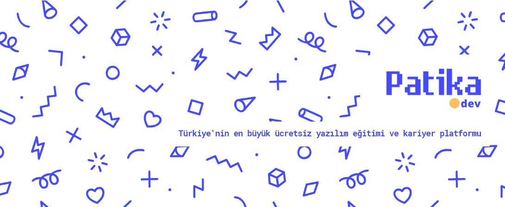

# Patika_Allianz_GelecegimAll_Bootcamp
### About Me
>Yunuscan Unal
>> - [LinkedIn](http://linkedin.com/in/yunuscanunal/) 
>> - [Email](mailto:yunuscanunal1@gmail.com) 
>> - [Patika](https://app.patika.dev/yunuscanunal)

---

### About Repository
This repository is about a [*Patika.dev*](patika.dev) bootcamp which is sponsorship by Allianz Türkiye.
This repository is including homeworks and projects given about different topics such as __Git__, __Angular__, __SQL__, __Java__ etc. in this bootcamp.

---

### About Programs

**Bootcamp** is included following topics:

- [x] GIT
- [x] Frontend Web Development
- [ ] SQL
- [ ] Software, Internet, Coding and Concepts
- [ ] Object Oriented Programming
- [ ] Java 101
- [ ] Java 102
- [ ] Object Oriented Programming -2
- [ ] Java Spring Boot
- [ ] PL/SQL
- [ ] Angular

