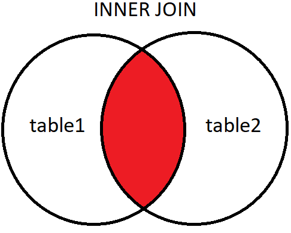
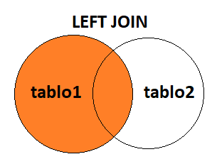
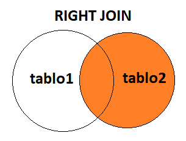

Lecture 1

# JOIN Kavramı (Birleştirme)

Veraitabanları çoğunlukla birbiri ile ilşkili olan tablolardan oluşur. Bu birbiri ile ilişkili olan tablardaki verileri farklı JOIN yapıları kullanarak sanal olarak birleştirip daha anlamlı veriler haline getirebiliriz.

## INNER JOIN

INNER JOIN yapısı sayesinde birbiriyle ilişkili olan tabloların birbiriyle eşleşen (kesişen) verilerini sıralayabiliriz. Senaryomuzda kitapları gösterdiğimiz __book__ tablosu ve yazarları gösterdiğimiz __author__ tablosu var, author tablosunun id sütunuyla book tablosunun author_id sütunlarında bulunan veriler sayesinde her iki tabloya ait bilgilerden daha anlamlı sonuçları elde edebiliriz.

Aşağıdaki SQL sorgusunda kitap isimlerini yazar isim ve soyisimler ile birlikte gösterebiliriz.
```SQL
SELECT book.title, author.first_name, author.last_name
FROM book
JOIN author ON author.id = book.author_id;
```

Yukarıdaki sorgumuzda tablolar arasındaki eşleşmeyi author.id ve book.author_id sütunları yardımıyla yapıyoruz.



Yukarıdaki görselimizde de gördüğümüz üzere INNER JOIN tablolar arasındaki eşleşen (kesişen) verileri sıralar. Bundan dolayı INNER JOIN yapısı simetriktir, author - book tablolarının yerlerinin değiştirilmesi sonucu etkilemez.

### INNER JOIN Söz Dizimi
```SQL
SELECT <sütun_adı>, <sütun_adı> ...
FROM <tablo1_adı>
INNER JOIN <tablo2_adı>
ON <tablo1_adı>.<sütun_adı> = <tablo2_adı>.<sütun_adı>;
```

Buradaki tablo1 "left table", tablo2 "right table" olarak da adlandırılır.

---

Lecture 2

# LEFT JOIN

LEFT JOIN yapısındaki tablo birleştirmesinde, birleştirme işlemi tablo 1 (soldaki tablo) üzerinden gerçekleştirilir. Senaryomuzu şu şekilde düşünelim eğer tablo 1 olarak __book__ tablosunu aldığımızda öncelikle book tablosundaki ilgili sütundaki tüm verileri alacağız, sonrasında bu verilerin eşleştiği ilgili tablo 2 sütunundaki verileri alacağız. Tablo 1 de olup Tablo 2 de olmayan veriler için __NULL__ değeri kullanılır.

Aşağıdaki SQL sorgusunda kitap isimlerinin tamamını alıyoruz, sonrasında bu kitap isimleriyle eşleşebilen yazar isimlerini alıyoruz. Kitap isimlerine karşılık olmayan yazarlar için NULL değeri alıyoruz.
```SQL
SELECT book.title, author.first_name, author.last_name FROM book
LEFT JOIN author
ON author.id = book.author_id;
```
Yukarıdaki sorgumuz sonucunda göreceğimiz gibi kitapların yazar bilgisine sahip değilse NULL değerlerini alırız.



Yukarıdaki görselimizde de gördüğümüz üzere LEFT JOIN tablolar arasındaki eşleşmeyi tablo 1 (soldaki tablo) üzerinden belirlenir.

## LEFT JOIN Söz Dizimi
```SQL
SELECT <sütun_adı>, <sütun_adı> ... FROM <tablo1_adı>
LEFT JOIN <tablo2_adı>
ON <tablo1_adı>.<sütun_adı> = <tablo2_adı>.<sütun_adı>;
```

Buradaki tablo1 "left table", tablo2 "right table" olarak da adlandırılır.

---

Lecture 3

# RIGHT JOIN

RIGHT JOIN yapısındaki tablo birleştirmesinde, birleştirme işlemi tablo 2 (sağdaki tablo) üzerinden gerçekleştirilir. Senaryomuzu şu şekilde düşünelim eğer tablo 2 olarak __author__ tablosunu aldığımızda öncelikle author tablosundaki ilgili sütundaki tüm verileri alacağız, sonrasında bu verilerin eşleştiği ilgili tablo 1 sütunundaki verileri alacağız. Tablo 2 de olup Tablo 1 de olmayan veriler için __NULL__ değeri kullanılır.

Aşağıdaki SQL sorgusunda yazar isim ve soyisim bilgilerinin tamamını alıyoruz, sonrasında eşleşebilen kitap isimlerini alıyoruz. Yazar bilgilerine karşılık olmayan kitap isimleri için NULL değeri alıyoruz.
```SQL
SELECT book.title, author.first_name, author.last_name
FROM book
RIGHT JOIN author
ON author.id = book.author_id;
```
Yukarıdaki sorgumuz sonucunda göreceğimiz gibi yazarlara ait olmayan kitaplar NULL değerlerini alırız.



Yukarıdaki görselimizde de gördüğümüz üzere LEFT JOIN tablolar arasındaki eşleşmeyi tablo 1 (soldaki tablo) üzerinden belirlenir.

## RIGHT JOIN Söz Dizimi
```SQL
SELECT <sütun_adı>, <sütun_adı> ...
FROM <tablo1_adı>
RIGHT JOIN <tablo2_adı>
ON <tablo1_adı>.<sütun_adı> = <tablo2_adı>.<sütun_adı>;
```
Buradaki tablo1 "left table", tablo2 "right table" olarak da adlandırılır.

---

Lecture 4

# FULL JOIN
Full JOIN yapısındaki tablo birleştirmesinde, birleştirme işlemi her iki tablo üzerinden gerçekleştirilir. Senaryomuzu şu şekilde düşünelim eğer tablo 1 olarak __book__ tablosunu aldığımızda öncelikle book tablosundaki ilgili sütundaki tüm verileri alacağız, sonrasında tablo 2 deki ilgili sütunlardan tüm verileri alacağız. Tablo 1 de olup Tablo 2 de olmayan ve Tablo 2 de olup Tablo 1 de olmayan veriler için __NULL__ değeri kullanılır.

Aşağıdaki SQL sorgusunda kitap isimlerinin tamamını alıyoruz, sonrasında yazar isimlerini alıyoruz. Eşleşemeyen veriler için NULL değeri alıyoruz.
```SQL
SELECT book.title, author.first_name, author.last_name FROM book
FULL JOIN author
ON author.id = book.author_id;
```
Yukarıdaki sorgumuz sonucunda göreceğimiz gibi kitapların yazar bilgisine sahip değilse NULL değerlerini alırız, yazarlar kitap bilgisine sahip değilse orada da NULL değerlerini alırız.


Yukarıdaki görselimizde de gördüğümüz üzere FULL JOIN tablolar arasındaki birleştirmeyi her iki tablo üzerinden belirlenir.

## FULL JOIN Söz Dizimi
```SQL
SELECT <sütun_adı>, <sütun_adı> ... FROM <tablo1_adı>
FULL JOIN <tablo2_adı>
ON <tablo1_adı>.<sütun_adı> = <tablo2_adı>.<sütun_adı>;
```
Buradaki tablo1 "left table", tablo2 "right table" olarak da adlandırılır.

---

Lecture 5

# UNION

__UNION__ operatörü sayesinde farklı SELECT sorgularıyla oluşan sonuçları tek bir sonuç kümesi haline getiririz.

## UNION Kullanımı
__bookstore__ veritabanında iki adet sorgu yapıyoruz. İlk sorgumuzda sayfa sayısı en fazla olan 5 kitabı, ikinci sorgumuzda ise isme göre 5 kitabı sıralıyoruz. UNION anahtar kelimesi sayesinde bu iki sorguyu da birleştirebiliriz.
```SQL
( SELECT * 
FROM book
ORDER BY title
LIMIT 5
)
UNION
(
SELECT * 
FROM book
ORDER BY page_number DESC
LIMIT 5
);
```
UNION operatörü kullanılacağı sorguların, sütun sayıları eşit olmalıdır ve sütunlardaki veri tipleri eşleşmelidir.

## UNION Söz Dizimi
```SQL
SELECT <sütun_adı>, <sütun_adı>... FROM <table1>
UNION
SELECT <sütun_adı>, <sütun_adı>...
FROM <table2>
```
## UNION ALL
UNION operatörü bize birleşik veriler içerisindeki tekrar edenleri göstermez. Tekrar edenleri görmek için __UNION ALL__ kullanırız.

---

Lecture 6

# INTERSECT ve EXCEPT

__INTERSECT__ operatörü sayesinde farklı SELECT sorgularıyla oluşan sonuçların kesişen verilerini tek bir sonuç kümesi haline getiririz.

## INTERSECT Kullanımı

__bookstore__ veritabanında iki adet sorgu yapıyoruz. İlk sorgumuzda sayfa sayısı en fazla olan 5 kitabı, ikinci sorgumuzda ise isme göre 5 kitabı sıralıyoruz. INTERSECT anahtar kelimesi sayesinde bu iki sorgu sonucunda oluşan veri kümelerinden kesişen verileri tek bir sonuçta birleştiririz.
```SQL
( SELECT * 
FROM book
ORDER BY title
LIMIT 5
)
INTERSECT
(
SELECT * 
FROM book
ORDER BY page_number DESC
LIMIT 5
);
```
INTERSECT operatörü kullanılacağı sorguların, sütun sayıları eşit olmalıdır ve sütunlardaki veri tipleri eşleşmelidir.

### INTERSECT Söz Dizimi
```SQL
SELECT <sütun_adı>, <sütun_adı>... FROM <table1>
INTERSECT
SELECT <sütun_adı>, <sütun_adı>...
FROM <table2>
```
### INTERSECT ALL

INTERSECT operatörü bize kesişen veriler içerisindeki tekrar edenleri göstermez. Tekrar edenleri görmek için __INTERSECT ALL__ kullanırız.

## EXCEPT Kullanımı

__bookstore__ veritabanında iki adet sorgu yapıyoruz. İlk sorgumuzda sayfa sayısı en fazla olan 5 kitabı, ikinci sorgumuzda ise isme göre 5 kitabı sıralıyoruz. EXCEPT anahtar kelimesi sayesinde ilk sorguda olup ancak ikinci sorguda olmayan verileri gösterir.
```SQL
( SELECT * 
FROM book
ORDER BY title
LIMIT 5
)
EXCEPT
(
SELECT * 
FROM book
ORDER BY page_number DESC
LIMIT 5
);
```
EXCEPT operatörü kullanılacağı sorguların, sütun sayıları eşit olmalıdır ve sütunlardaki veri tipleri eşleşmelidir.

### EXCEPT Söz Dizimi
```SQL
SELECT <sütun_adı>, <sütun_adı>... FROM <table1>
EXCEPT
SELECT <sütun_adı>, <sütun_adı>...
FROM <table2>
```
### EXCEPT ALL

EXCEPT operatörü bize ilk sorguda olan ancak ikinci sorguda olmayan veriler içerisindeki tekrar edenleri göstermez. Tekrar edenleri görmek için __EXCEPT ALL__ kullanırız.