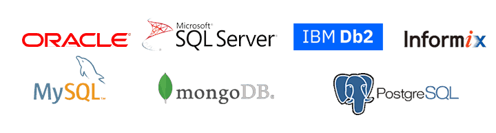

Lecture 1

# SQL Nedir?
## Merhabalar,

Temel SQL çalışmamıza hoş geldiniz. Bu çalışmalarımız boyunca declarative bir programlama dili olan SQL - Structered Query Language - üzerine konuşacağız.

SQL tanımına dair detayları ileride göreceğiz. Bu giriş videosunda konu başlıklarını, temel kaynakları ve çalışma yöntemimizi konuşacağız.

## SQL Nedir?
Bu bölümde SQL tanımıyla beraber veri, veritabanı ve veritabanı yönetim sistemi kavramlarından bahsettik. Veritabanı yönetim sistemi olarak son dönemlerin en popüler yazılımı olan POSTGRESQL kullandık ve POSTGRESQL'i bilgisayarımıza yükledik.

## SQL Temelleri I
Bu bölümde üzerine konuşulan anahtar kelimeler: SELECT - COUNT - WHERE - BETWEEN - IN - LIKE - ILIKE - DISTINCT. Karşılaştırma ve Mantıksal operatörlerden konuştuk. Aynı zamanda PSQL terminal ara yüzüne değindik.

## SQL Temelleri II
Bu bölümde üzerine konuşulan anahtar kelimeler: ORDER BY - LIMIT - OFFSET - GROUP BY - HAVING - ALIAS. Bunların yanında aggregate fonksiyonlarını konuştuk.

### Tablolarla Çalışmak
Bu bölümde temel tablo yapısı üzerine konuştuk. Tabloları nasıl oluştururuz, tabloları birbirleriyle ilişkisinden bahsettik. Primary Key nedir, Foreign Key nedir sorularına cevap aradık. Kısıtlama kavramını örneklendirdik. Temel veri tipleri nelerdir, onlara baktık.

### JOIN (Birleştirme İşlemleri)
Bu bölümde birden fazla tablolar üzerinde sıklıkla kullanılan JOIN birleştirme işlemlerinden bahsettik. Temel JOIN işlemleri olan INNER, LEFT, RIGHT ve FULL JOIN konularına değinildi. Ayrıca yine bu bölümde farklı SQL sorgularını birleştirmede kullanıla UNION, INTERSECT ve EXCEPT operatörlerinden bahsettik.

### Sub Queries (Alt sorgular)
Bu bölümde alt sorular kavramından ve SLQ de sıklıkla kullanılan Matematik ve String fonksiyonlarından konuştuk.

---

Lecture 2

# Veri ve Veritabanı
## VERİ
Ölçüm, sayım, deney, gözlem veya araştırma sonucuyla elde edilen ham bilgilerdir.

## VERİTABANI
Verilerin organize bir şekilde depolanmasını sağlayan sistemlerdir.

## Düzenli verilere sahip olursak;
* İleriye yönelik geliştirici kararlar verebiliriz.
* Hatalarımızı daha kolay çözeriz.
* Geleceğe yönelik başarılı tahminlerde bulunabiliriz.

Peki, gelelim kritik soruya. Bizler örneğin __EXCEL__ benzeri yazılımlar sayesinde verilerimizi saklayabiliriz. Neden bir veritabanına ihtiyaç duyalım?

- Veritabanı sayesinde sütunlarda bulunacak verilerin aynı veri tipinde olmasını garanti ederiz.
- Veritabanları sayesinde çok büyük boyutlu veri kümeleriyle daha kolay çalışırız.
- Çoklu kullanıcı yönetimi için veri tabanları daha uygundur.
- Veritabanları başka yazılım ve uygulamalarla daha kolay çalışır.

---

Lecture 3

# Veritabanı Yönetim Sistemi (DBMS)
Veritabanı verilerimizi organize bir şekilde depolamımızı sağlayan yapılardı. İşte bu veritabanımızı oluşturmamızı, yönetmemizi ve SQL yardımıyla gerekli gördüğümüz sorguları yapmamızı sağlayan yazılımlara Database Management System veritabanı yönetim sistemi adı verilir.

Bizler SQL sorguları sayesinde veritabanımız üzerinde yapmak istediğimiz işlemler veritabanı yönetim sistemi yazılımı aracılığıyla yaparız.


Yukarıdaki şekilde de gördüğümüz üzere farklı kaynaklardan gelen sorgular DBMS yazılımı sayesinde farklı veritabanlarında kullanılır. Genel kullanım olarak bizler pratikte veri, veritabanı ve veritabanı yönetim sisteminin tamamını VERİTABANI olarak adlandırmak şekilde bir eğilimimiz vardır.

Farklı ihtiyaçlara göre çeşitli veritabanı yönetim sistemleri bulunur. Temel veritabanı yönetim sistemleri:

## Temel Veritabanı Yönetim Sistemleri
- Hiyerarşik Veritabanı
- Ağ Veritabanı
- İlişkisel Veritabanı (RDBMS)
- Nesneye Yönelik Veritabanı

## İlişkisel Veritabanı Yönetim Sistemleri
İlişkisel veritabanı yönetim sistemlerinde veriler satır ve sütunlarında oluşan tablolarda tutulur. Her sütunda aynı tür verilerin tutulması sebebiyle yüksek bir veri tutarlılığına sahiptir.

Aşağıda popüler veritabanı yönetim sistemi yazılımlarını görebilirsiniz.



---

Lecture 4

# SQL (Structured Query Language) Nedir?
SQL Türkçe ifadesiyle yapılandırılmış sorgu dili anlamına gelmektedir. Biz SQL sayesinde verilerimizin bulunduğu veritabanı ile iletişime geçeriz.

Daha önce de konuştuğumuz gibi veritabanı yönetim sitemi (DBMS) veritabanını barındıra bir yazılım. Bizler bu yazılım üzerinden verilerimiz için yapmak istediğimiz sorguları SQL dili standartlarına uygun olarak yazmak durumundayız.

### Bir Programlama dili olarak SQL
SQL üzerine konuşulurken ilk olarak şu soru akla gelir. SQL bir programlama dili midir? Evet, SQL ilişkisel veritabanı yönetim sistemleri ile ilişki kurmamızı sağlayan bir declarative __bildirimsel__ bir programlama dilidir.

## Bildirimsel Yaklaşım
Aşağıdaki örnek bir SQL sorgusu bulabilirsiniz.

```SQL
SELECT title FROM book
WHERE page_number > 200;
```
Yukarıdaki sorgumuzda, veritabanındaki book tablosundan sayfa sayısı 200 den daha fazla olan kitapları görmek istiyoruz. Burada biz işin sonuç kısmıyla ilgileniyoruz. SQL, DBMS ile nasıl çalışır, arka tarafta yapılan işlemin bizim açımızdan önemi yoktur. Bundan dolayı SQL declarative yani bildirimsel, beyan edici bir yaklaşıma sahiptir.

### Dördüncü Nesil Programlama Dili
SQL daha az kod yazarak ve daha çok belirli şablonlar kullanan bir programlama dili olarak dördüncü nesil bir programlama dilidir. Yapılması istenen işlemin her basamağının ayrıca kodlanmasına gerek duyulmaz.

---

Lecture 5

# PostgreSQL Kurulumu
Çalışmalarımız boyunca veritabanı yönetim sistemi olarak PostgreSQL kullanacağız. PostgreSQL açık kaynak kodlu ve popüler bir ilişkisel veritabanı yönetim sistemidir.

## Neden PostgreSQL?
- Açık kaynak kodlu
- Çeşitli veri tipi desteği
- Güçlü dökümantasyon ve topluluk desteği
- Tüm işletim sistemlerine uygunluk
- ACID uyumluluk
- Güvenlidir
- Büyük verilerle kolay çalışma

---

Lecture 6

# SELECT
## Sorgu (Query)
SQL komutlarını içeren sorgu cümleleridir.

Üzerine ilk konuşacağımız SQL komutu SELECT komutudur. SELECT en çok kullanılan SQL komutudur ve veritabanından belirtilen sütunlardaki verileri çekmemizi sağlar. Ayrıca SELECT komutunu çoğunlukla diğer SQL komutlarıyla birlikte kullanırız.

## SELECT Söz Dizimi
```SQL
SELECT <sütun_adı>, <sütun_adı>, ...
FROM <tablo_adı>;
```
Eğer tablodaki tüm sütunlardaki verileri çekmek istersek asteriks * karakterinden faydalanırız.
```SQL
SELECT *
FROM <tablo_adı>;
```
### SQL komutlarının büyük harf - küçük harf duyarlılıkları yoktur. (Case Insensitive)
Aşağıdaki sorguların tamamı aynı sonucu verir.
```SQL
SELECT <sütun_adı>, <sütun_adı>, ...
FROM <tablo_adı>;
```
```SQL
select <sütun_adı>, <sütun_adı>, ...
from <tablo_adı>;
```
```SQL
Select <sütun_adı>, <sütun_adı>, ...
From <tablo_adı>;
```
Ancak biz bu çalışmalarımız boyunca yazdığımız SQL komutlarının daha kolay anlaşılması açısından SELECT örneğinde olduğu gibi büyük harflerden oluşan yazımı kullanacağız.

### SELECT Örnek Kullanım
```SQL
SELECT first_name, last_name
FROM actor;
```
Bu sorgumuzda dvdrental veritabanında bulunan actor tablosundaki first_name ve last_name sütunlarında bulunan verileri çekiyoruz.

---

Lecture 7

# WHERE ve Karşılaştırma Operatörleri
## WHERE
SELECT komutu ile yaptığımız çalışmalarda bizler tüm sütunların veya ilgili sütunlarda bulunan verilerin tamamını çekmek isteriz. Çoğu durumda ise verilerin tamamını değil belirli koşulları sağlayan verileri görmek isteriz. Bunun için WHERE anahtar kelimesini kullanırız.

## WHERE Söz Dizimi
```SQL
SELECT <sütun_adı>, <sütun_adı>, ...
FROM <tablo_adı>
WHERE <koşul>;
```

Eğer tablodaki tüm sütunlardaki verileri çekmek istersek asteriks * karakterinden faydalanırız.
```SQL
SELECT *
FROM <tablo_adı>;
```
### WHERE Örnek Kullanım
```SQL
SELECT title, replacement_cost
FROM film
WHERE replacement_cost = 14.99;
```
Bu sorgumuzda __dvdrental__ veritabanında bulunan __film__ tablosundaki __title__ ve __replacement_cost__ sütunlarında bulunan verileri çekiyoruz ancak bu kez tüm verileri değil __replacement_cost = 14.99__ koşulunu sağlayan verileri alıyoruz.

### Karşılaştırma Operatörleri
Yukarıda da bahsettiğimiz üzere __WHERE__ anahtar kelimesi koşul ile birlikte çalışır. Aşağıda SQL ile birlikte kullanılan karşılaştırma operatörlerini görebilirsiniz.


---

Lecture 7


# WHERE ve Mantıksal Operatörler
Geçen çalışmamızda WHERE anahtar kelimesi ve karşılaştırma operatörleri üzerine konuştuk. Karşılaştırma operatörleri sayesinde koşulumuzu belirtiyorduk ancak çoğu durumda biz birden fazla koşulu gerçekleştirme isteriz bunun için mantıksal operatörlerden faydalanırız.

## Mantıksal Operatörler
Yukarıda da bahsettiğimiz üzere __WHERE__ anahtar kelimesi koşul ile birlikte çalışır. Aşağıda SQL ile birlikte kullanılan karşılaştırma operatörlerini görebilirsiniz.

### Örnek Kullanım
```SQL
SELECT *
FROM actor 
WHERE first_name = 'Penelope' AND last_name = 'Monroe' ;
```

Bu sorgumuzda __dvdrental__ veritabanında bulunan actor tablosundaki tüm sütunlarında bulunan verileri çekiyoruz ancak bu kez iki koşulumuz var. __AND__ operatörünün true sonucu dönmesi için bu iki koşulumuzun da sağlanması gerekiyor. Sıralanacak verilerin __first_name__ sütunundaki değeri 'Penelope' ve last_name sütunundaki değerinin 'Monroe' olması gerekmektedir.
```SQL
SELECT *
FROM actor 
WHERE first_name = 'Penelope' OR first_name = 'Bob' ;
```
Bu sorgumuzda __dvdrental__ veritabanında bulunan actor tablosundaki tüm sütunlarında bulunan verileri çekiyoruz ancak bu kez iki koşulumuz var. __OR__ operatörünün true sonucu dönmesi için bu iki koşulumuzunda herhangi birinin sağlanması yeterlidir. Sıralanacak verilerin __first_name__ sütunundaki değeri 'Penelope' veya 'Bob' olması gerekmektedir.
```SQL
SELECT *
FROM film 
WHERE NOT rental_rate = 4.99 ;
```
Bu sorgumuzda __dvdrental__ veritabanında bulunan film tablosundaki tüm sütunlarında bulunan verileri çekiyoruz ancak bu kez koşulumuzu __NOT__ yani değil mantıksal operatörü yardımıyla oluşturmuşuz. NOT operatörü bize verilerin hangi koşul dışı olduğunu gösterir. Örneğimizin senaryosu; Film tablomuzda bulunan tüm sütunlardaki verileri sıralayacağız ancak bu verilerin rental_rate sütununda bulunan değerleri 4.99' a eşit OLMAYACAK!
```SQL
SELECT *
FROM film 
WHERE NOT (rental_rate = 4.99 OR rental_rate = 2.99)
```
Mantıksal operatörleri sıklıkla birlikte kullanırız. Yukarıdaki örneğimizde sıralayacağımız verilerin rental_rate sütunlarında bulunan değerlerinin 4.99 veya 2.99 olmamasını istiyoruz.