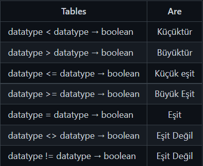

Lecture 1

# SELECT
## Sorgu (Query)
SQL komutlarını içeren sorgu cümleleridir.

Üzerine ilk konuşacağımız SQL komutu SELECT komutudur. SELECT en çok kullanılan SQL komutudur ve veritabanından belirtilen sütunlardaki verileri çekmemizi sağlar. Ayrıca SELECT komutunu çoğunlukla diğer SQL komutlarıyla birlikte kullanırız.

## SELECT Söz Dizimi
```SQL
SELECT <sütun_adı>, <sütun_adı>, ...
FROM <tablo_adı>;
```
Eğer tablodaki tüm sütunlardaki verileri çekmek istersek asteriks * karakterinden faydalanırız.
```SQL
SELECT *
FROM <tablo_adı>;
```
### SQL komutlarının büyük harf - küçük harf duyarlılıkları yoktur. (Case Insensitive)
Aşağıdaki sorguların tamamı aynı sonucu verir.
```SQL
SELECT <sütun_adı>, <sütun_adı>, ...
FROM <tablo_adı>;
```
```SQL
select <sütun_adı>, <sütun_adı>, ...
from <tablo_adı>;
```
```SQL
Select <sütun_adı>, <sütun_adı>, ...
From <tablo_adı>;
```
Ancak biz bu çalışmalarımız boyunca yazdığımız SQL komutlarının daha kolay anlaşılması açısından SELECT örneğinde olduğu gibi büyük harflerden oluşan yazımı kullanacağız.

### SELECT Örnek Kullanım
```SQL
SELECT first_name, last_name
FROM actor;
```
Bu sorgumuzda dvdrental veritabanında bulunan actor tablosundaki first_name ve last_name sütunlarında bulunan verileri çekiyoruz.

---

Lecture 2

# WHERE ve Karşılaştırma Operatörleri
## WHERE
SELECT komutu ile yaptığımız çalışmalarda bizler tüm sütunların veya ilgili sütunlarda bulunan verilerin tamamını çekmek isteriz. Çoğu durumda ise verilerin tamamını değil belirli koşulları sağlayan verileri görmek isteriz. Bunun için WHERE anahtar kelimesini kullanırız.

## WHERE Söz Dizimi
```SQL
SELECT <sütun_adı>, <sütun_adı>, ...
FROM <tablo_adı>
WHERE <koşul>;
```

Eğer tablodaki tüm sütunlardaki verileri çekmek istersek asteriks * karakterinden faydalanırız.
```SQL
SELECT *
FROM <tablo_adı>;
```
### WHERE Örnek Kullanım
```SQL
SELECT title, replacement_cost
FROM film
WHERE replacement_cost = 14.99;
```
Bu sorgumuzda __dvdrental__ veritabanında bulunan __film__ tablosundaki __title__ ve __replacement_cost__ sütunlarında bulunan verileri çekiyoruz ancak bu kez tüm verileri değil __replacement_cost = 14.99__ koşulunu sağlayan verileri alıyoruz.

### Karşılaştırma Operatörleri
Yukarıda da bahsettiğimiz üzere __WHERE__ anahtar kelimesi koşul ile birlikte çalışır. Aşağıda SQL ile birlikte kullanılan karşılaştırma operatörlerini görebilirsiniz.




---

Lecture 3


# WHERE ve Mantıksal Operatörler
Geçen çalışmamızda WHERE anahtar kelimesi ve karşılaştırma operatörleri üzerine konuştuk. Karşılaştırma operatörleri sayesinde koşulumuzu belirtiyorduk ancak çoğu durumda biz birden fazla koşulu gerçekleştirme isteriz bunun için mantıksal operatörlerden faydalanırız.

## Mantıksal Operatörler
Yukarıda da bahsettiğimiz üzere __WHERE__ anahtar kelimesi koşul ile birlikte çalışır. Aşağıda SQL ile birlikte kullanılan karşılaştırma operatörlerini görebilirsiniz.

### Örnek Kullanım
```SQL
SELECT *
FROM actor 
WHERE first_name = 'Penelope' AND last_name = 'Monroe' ;
```

Bu sorgumuzda __dvdrental__ veritabanında bulunan actor tablosundaki tüm sütunlarında bulunan verileri çekiyoruz ancak bu kez iki koşulumuz var. __AND__ operatörünün true sonucu dönmesi için bu iki koşulumuzun da sağlanması gerekiyor. Sıralanacak verilerin __first_name__ sütunundaki değeri 'Penelope' ve last_name sütunundaki değerinin 'Monroe' olması gerekmektedir.
```SQL
SELECT *
FROM actor 
WHERE first_name = 'Penelope' OR first_name = 'Bob' ;
```
Bu sorgumuzda __dvdrental__ veritabanında bulunan actor tablosundaki tüm sütunlarında bulunan verileri çekiyoruz ancak bu kez iki koşulumuz var. __OR__ operatörünün true sonucu dönmesi için bu iki koşulumuzunda herhangi birinin sağlanması yeterlidir. Sıralanacak verilerin __first_name__ sütunundaki değeri 'Penelope' veya 'Bob' olması gerekmektedir.
```SQL
SELECT *
FROM film 
WHERE NOT rental_rate = 4.99 ;
```
Bu sorgumuzda __dvdrental__ veritabanında bulunan film tablosundaki tüm sütunlarında bulunan verileri çekiyoruz ancak bu kez koşulumuzu __NOT__ yani değil mantıksal operatörü yardımıyla oluşturmuşuz. NOT operatörü bize verilerin hangi koşul dışı olduğunu gösterir. Örneğimizin senaryosu; Film tablomuzda bulunan tüm sütunlardaki verileri sıralayacağız ancak bu verilerin rental_rate sütununda bulunan değerleri 4.99' a eşit OLMAYACAK!
```SQL
SELECT *
FROM film 
WHERE NOT (rental_rate = 4.99 OR rental_rate = 2.99)
```
Mantıksal operatörleri sıklıkla birlikte kullanırız. Yukarıdaki örneğimizde sıralayacağımız verilerin rental_rate sütunlarında bulunan değerlerinin 4.99 veya 2.99 olmamasını istiyoruz.

---

Lecture 4

# BETWEEN ve IN
## BETWEEN
Aşağıdaki sorgumuzda __AND__ mantıksal operatörü yardımıyla __film__ tablosunda bulunan verilerimizi uzunluğu 140 tan küçük eşit __VE__ 100 den büyük eşit olmak üzere sıralıyoruz.

```SQL
SELECT *  FROM film
WHERE length >= 100 AND length <= 140;
```
Burada temel olarak yaptığımız belirli aralıkta bulunan verileri sıralamak. Bunun __BETWEEN ... AND__ yapısını kullanarak da yapabiliriz.


### BETWEEN AND Söz Dizimi

```SQL
SELECT <sütun_adı>, <sütun_adı>, ... FROM <tablo_adı>
WHERE <koşul>;
```

### BETWEEN Örnek Kullanım
```SQL
SELECT * FROM film
WHERE length BETWEEN 100 AND 140;
-- WHERE length >= 100 AND length <= 140 ifadesi ile aynı sonucu verir.
```
Burada dikkat edilmesi gereken nokta 100 ve 140 sınır değerleri aralığa dahildir.

## IN
Şöyle bir senaryo düşünelim, yine film tablosundan uzunluğu 30, 60, 90 veya 120 dakikaya eşit olan verileri sıralayalım.

```SQL
SELECT *  FROM film
WHERE length = 30 OR length = 60 OR length = 90 OR length = 120;
```
sorgusuyla verileri aldık ancak burada şöyle bir sorunumuz var peki 4 farklı değer için değil 14 farklı değer için bu sorgumuzu gerçekleştirmek için 14 ayrı OR mantıksal operatörü kullanmamız gerekirdi. Bunun yerine istenilen değerleri liste haline geitip IN anahtar kelimesiyle kullanabiliriz.

### IN Söz Dizimi
```SQL
SELECT <sütun_adı>, <sütun_adı>, ... FROM <tablo_adı>
WHERE <sütun_adı> IN (değer1, değer2, ...);
```
### IN Örnek Kullanım
```SQL
SELECT * FROM film
WHERE length IN (30,60,90,120);
```


---

Lecture 5

# LIKE ve ILIKE
Aşağıdaki sorgumuzda actor tablomuzda bulunan tüm sütunlardaki verileri first_name sütununda ki değeri 'Penelope' olmak üzere getiriyoruz.

```SQL
SELECT *
FROM actor
WHERE first_name = 'Penelope';
```
Ancak bizler bazı durumlarda bu şekilde tam eşleşme değil belirli şablonlara uyan koşulların sağlanmasını isteriz. Örneğin aşağıdaki sorgumuzda first_name sütunun 'Penelope' değerine eşit olmasını değil, ilk harfin 'P' olması koşulunu sağlar. Bunun için __LIKE__ operatörünü kullanırız.
```SQL
SELECT *
FROM actor
WHERE first_name LIKE 'P%';
```
Burada kullanılan % karakteri sıfır, bir veya daha fazla karakteri temsil eder ve Wildcard olarak isimlendirilir. Bir diğer wildcard karakteri _ karakteridir ve bir karakteri temsil eder.

## LIKE Söz Dizimi
```SQL
SELECT <sütun_adı>, <sütun_adı>, ...
FROM <tablo_adı>
WHERE <sütun_adı> LIKE <şablon>;
```
### ILIKE operatörü LIKE operatörünün case - insensitive versiyonudur.

---

Lecture 6

# DISTINCT ve COUNT
## DISTINCT
Şimdiye kadar yaptığımız SQL sorgularında genellikle verileri belirli koşullar altında sıraladık. Dikkat ettiyseniz bir çok durumda aynı sütün içerisinde birbirinin aynı olan veriler ile karşılaştık. Örneğin __dvdrental__ veritabanı içerisinde bulunan __film__ tablosundaki replacement_cost, rental_rate gibi sütunlar birbirini tekrar eden verilerden oluşmaktadır. Bazı durumlarda bir sütun içerisinde bulunan farklı değerleri görmek isteriz.
```SQL
SELECT DISTINCT rental_rate 
FROM film;
```
sorgusu bize rental_rate sütununda bulunan birinden farklı 2.99, 0.99, 4.99 verilerini gösterir.

### SELECT DISTINCT Söz Dizimi
```SQL
SELECT DISTINCT <sütun_adı>, <sütun_adı>, ...
FROM <tablo_adı>;
```
## COUNT
COUNT __aggregate__ fonksiyonu ilgili sorgu sonucunda oluşan veri sayısını bildirir. Aşağıdaki sorguda ismi 'Penelope' olan aktörleri sıralıyoruz.
```SQL
SELECT * 
FROM actor
WHERE first_name = 'Penelope';
```
ancak veri sayısını bulmak istersek __COUNT__ fonksiyonunu kullanırız.
```SQL
SELECT COUNT(*)
FROM actor
WHERE first_name = 'Penelope';
```
Yukarıda da belirttiğimiz gibi COUNT fonksiyonu ile sorgu sonucunda ortaya verileri sayıyoruz. Bu nedenle COUNT(*) veya COUNT(sütun_adı) aynı sonucu verir.

---
