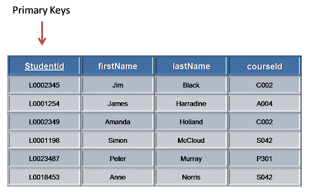
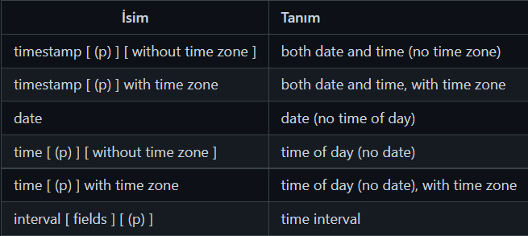
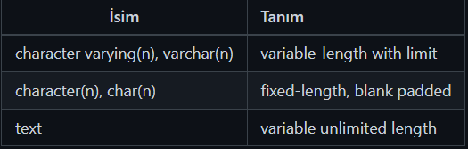

Lecture 1

# Tablo Oluşturmak ve Silmek (CREATE - DROP)
## Tablo Oluşturmak - CREATE
SQL ile yeni bir tablo oluşturmak için __CREATE__ anahtar kelimesi kullanılır. Tablo oluştururken sonrasında daha detaylı konuşacağımız 3 önemli başlık daha vardır.

Sütunlara verilecek isim, sütunların veri tipi ve varsa sütunlarda bulunan kısıtlama yapıları.

#### Tablo Oluşturmak - CREATE Söz Dizimi
```SQL
CREATE TABLE <tablo_adı> (
    <sütun_adı> <veri_tip> (kısıtlama_adı>,
    <sütun_adı> <veri_tip> (kısıtlama_adı>,
   ....
);
```
#### Tablo Oluşturmak - CREATE Örnek Kullanım
__author__ isminde bir tablo oluşturalım, id, first_name, last_name, email, birthday sütunları olsun. Veri tipleri ve kısıtlama yapılarıyla ilgili sonrasında detaylı olarak konuşacağız.
```SQL
CREATE TABLE author (
  id SERIAL PRIMARY KEY,
  first_name VARCHAR(50) NOT NULL,
  last_name VARCHAR(50) NOT NULL,
  email VARCHAR(100)
  birthday DATE
);
```
## Tablo Silmek - DROP
Oluşturduğumuz tabloları silmek için __DROP__ anahtar kelimesi kullanılır.

#### Tablo Silmek - DROP Söz Dizimi
```SQL
DROP TABLE (IF EXISTS) <tablo_adı>;
```
Burada __IF EXISTS__ yapısını kullanarak yanlış tablo ismi yazımı durumunda hata mesajı almayı önleriz.

#### Tablo Silmek - DROP Örnek Kullanım
"test" isimli tablomuzu silmek istersek;
```SQL
DROP TABLE IF EXISTS test;
```

---

Lecture 2

# Tablo Verilerini Güncellemek (UPDATE - DELETE)
Bir tabloda bulunan verileri güncellemek veya silmek için öncelikle örnek bir tablo oluşturup içine 5 date veri yerleştireceğim.

Bunun için _Mockaroo_ benzeri servisleri kullanabiliriz. Aşağıdaki örnek tablo oluşturma ve veri girme komutlarını bulabilirsiniz.
```SQL
CREATE TABLE my_apps (
	id INT,
	name VARCHAR(50),
	price VARCHAR(50)
);

INSERT INTO my_apps (id, name, price) values (1, 'Ronstring', '$0.96');
INSERT INTO my_apps (id, name, price) values (2, 'Duobam', '$3.44');
INSERT INTO my_apps (id, name, price) values (3, 'Tresom', '$2.21');
INSERT INTO my_apps (id, name, price) values (4, 'Redhold', '$2.52');
INSERT INTO my_apps (id, name, price) values (5, 'Y-find', '$9.14');
```
### UPDATE
__UPDATE__ anahtar kelimesi sayesinde tablomuzda bulunan verileri güncelleyebiliriz.

#### UPDATE Söz Dizimi
```SQL
UPDATE <tablo_adı>
SET <sütun_adı> = değer, 
    <sütun_adı> = değer,
    ----
WHERE <koşul_adı>;
```
#### UPDATE Örnek Kullanım
__my apps__ tablosunda bulunan ve id 2' ye eşit olan verimizin name sütunundaki degerini 'Mayak' price sütunundaki değerini '$5.22' ile değiştirelim.
```SQL
UPDATE my_apps
SET name = 'Mayak',
	price = '$5.22'
WHERE id = 2;
```
### DELETE
__DELETE__ anahtar kelimesi sayesinde tablomuzda bulunan verileri silebiliriz.

#### DELETE Söz Dizimi
```SQL
DELETE FROM <tablo_adı>
WHERE <koşul_adı>;
```
#### DELETE Örnek Kullanım
__my apps__ tablosunda bulunan name sütunundaki verisi 'Tresom' olan satırı silelim.
```SQL
DELETE FROM my_apps
WHERE name = 'Tresom';
```

---

Lecture 3

# Birincil Anahtar ve Yabancı Anahtar (PRIMARY KEY ve FOREIGN KEY)

## PRIMARY KEY

__PRIMARY KEY__ bir tabloda bulunan veri sıralarını birbirinden ayırmamızı sağlayan bir kısıtlama (constraint) yapısıdır. O tabloda bulunan veri sıralarına ait bir "benzersiz tanımlayıcıdır".

- Benzersiz (Unique) olmalıdır.
- NULL değerine sahip olamaz.
- Bir tabloda en fazla 1 tane bulunur.



Yukarıda bulunan görselimizde de gördüğünüz gibi STUDENT tablosunda bulunan __StudentId__ sütunu PRIMARY KEY yapısındadır ve her satırı (veri kaydını) diğer satırlardan ayırmamızı sağlar.

## FOREIGN KEY

__FOREIGN KEY__ bir tabloda bulunan herhangi bir sütundaki verilerin genelde başka bir tablo sütununa referans vermesi durumudur, tablolar arası ilişki kurulmasını sağlar.

- Bir tabloda birden fazla sütun FK olarak tanımlanabilir.
- Aynı sütunun içerisinde aynı değerler bulunabilir.


Yukarıda bulunan görselimizde de gördüğünüz gibi STUDENT tablosunda bulunan courseId sütunu FOREIGN KEY yapısındadır ve başka bir tablo olan "Course" tablosundaki __courseId__ sütununa referans verir.

---

Lecture 4

# Veri Tipleri I

## Temel Veri Tipleri

- Sayısal Veri Tipleri
- Karakter Veri Tipleri
- Boolean Veri Tipleri
- Date / Time Veri Tipleri

## Sayısal Veri Tipleri


---

Lecture 5

# Veri Tipleri II

## Karakter Veri Tipleri



Sınırlı sayıda karekter kullanımı için VARCHAR veya CHAR veri tipleri kullanılır. VARCHAR veri tipi doldurulmayan karakterleri yok sayar, CHAR veri tipi ise doldurulmayan karakterler için boşluk bırakır. Sınırsız karekter kullanımı için ise TEXT veri tipi kullanılır.

## Boolean Veri Tipleri

TRUE, FALSE veya NULL (Bilinmeyen) değerlerini alabilirler.

- TRUE: true, yes, on, 1
- FALSE: false, no, off, 0

## Zaman / Tarih Veri Tipleri



---

Lecture 6

# ALTER ve NOT NULL

## NOT NULL

Birçok durumda bizler herhangi bir sütuna yazılacak olan verilere belirli kısıtlamalar getirmek isteriz. Örneğin yaş sütünunda sadece sayısal verilerin olmasını isteriz ya da kullanıcı adı sütununda bilinmeyen (NULL) değerlerin olasını istemeyiz. Bu gibi durumlarda ilgili sütunda __CONSTRAINT__ kısıtlama yapıları kullanılır.

__NULL__ bilinmeyen veri anlamındadır. Boş string veya 0 verilerinden farklıdır. Şu şekilde bir senaryo düşünelim bir kullanıcının email hesabı yoksa buradaki veriyi boş string şeklinde düşünebiliriz. Acak eğer kullanıcının maili var ancak ne olduğunu bilmiyorsak bu durumda o veri NULL (bilinmeyen) olarak tanımlanabilir.

### NOT NULL Kullanımı

Employees şeklinde bir tablomuzu oluşturalım. Tablodaki first_name ve last_name sütunlarında bilinmeyen veri istemiyoruz, bu sütunlarda NOT NULL kısıtlama yapısı kullanabiliriz.
```SQL
CREATE TABLE Employees (     id SERIAL PRIMARY KEY,
    first_name VARCHAR(100) NOT NULL,
    last_name VARCHAR(100) NOT NULL,
    age INTEGER
);
```
## ALTER ve NOT NULL

ALTER anahtar kelimesini varolan bir tabloda değişiklik yapmak için kullanılır. Aşağıdaki senaryoda bir sütuna __NOT NULL__ kısıtlaması vermek için aşağıdaki söz dizimi yapısı kullanılır.
```SQL
ALTER TABLE <tablo_adı> ALTER COLUMN <sütun_adı>
SET NOT NULL;
```

---

Lecture 7

# UNIQUE

__UNIQUE__ kısıtlaması ile uyguladığımız sütundaki verilerin birbirlerinden farklı benzersiz olmalarını isteriz. PRIMARY KEY kısıtlaması kendiliğinden __UNIQUE__ kısıtlamasına sahiptir.

NOT NULL kısıtlamasında olduğu gibi tablo oluştururken veya ALTER komutu ile beraber tablo oluştuktan sonra da kullanabiliriz.

## UNIQUE Kullanımı

Employees şeklinde bir tablomuzu oluşturalım. Tablodaki email sütununda bulunan verileri __UNIQUE__ olarak belirlemek istersek.
```SQL
CREATE TABLE Employees (     ---
    emaile VARCHAR(100) UNIQUE,
    ----
);
```
## ALTER ve UNIQUE

ALTER TABLE <tablo_adı> ADD UNIQUE <sütun_adı>

Bu arada herhangi bir sütuna __UNIQUE__ kısıtlaması getirirsek ve öncesinde UNIQUE olmayan verileri kaldrmamız gerekir.

---

Lecture 8

# CHECK
__CHECK__ kısıtlaması ile uyguladığımız sütundaki verilere belirli koşullar verebiliriz. Örneğin age (yaş) olarak belirlediğimiz bir sütuna negatif değerler verebiliriz veya web portaline üye olan kullanıcıların yaşlarının 18 yaşından büyük olması gibi kendi senaryolarımıza uygun başka kıstlamalar da vermek isteyebiliriz.

CHECK kısıtlamasını da tablo oluştururken veya ALTER komutu ile beraber tablo oluştuktan sonra kullanabiliriz.

## CHECK Kullanımı
Employees şeklinde bir tablomuzu oluşturalım. Tablodaki age sütununda bulunan verilerin 18'e eşit veya büyük olmasını istiyoruz.
```SQL
CREATE TABLE Employees (     ---
    age INTEGER CHECK (age>=18)
    ----
);
```
## ALTER ve CHECK
```SQL
ALTER TABLE <tablo_adı> ADD CHECK (age>=18)
```

---

